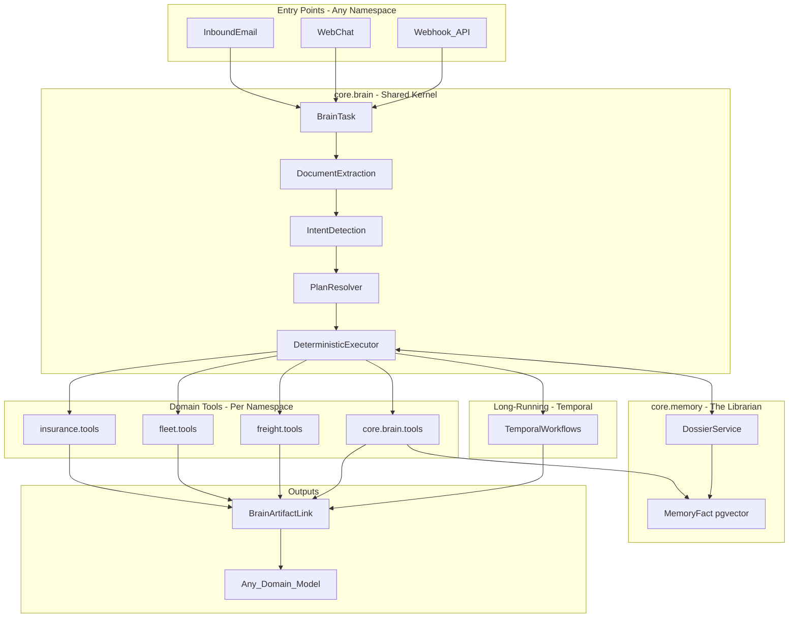

# AI Brain v1 — NUKE & REBUILD (100% Fresh, Zero Reuse)

> **NUKE means NUKE.** This plan builds `core.brain/` from scratch. We do NOT import, wrap, call, or integrate with old CopilotService/handlers. We build fresh, test E2E, point entry points at Brain, delete old code.

> ⚠️ **CRITICAL INTEGRATION**: This plan MUST be read alongside `mw-dj6-v2/fromscratch.md` (MinuteWork v4.2 Architecture). The Brain uses the v4.2 identity model (`identity.Tenant`, NOT legacy `core.Org`) and MUST wrap tool execution in `TenantContext` for `TenantScopedManager` to work.

## What is MinuteWork?

**MinuteWork** is a Connected B2B Operating System for Logistics & Insurace. We are building a multi-sided network where every participant—Broker, Carrier (Fleet), Insurance, and Shipper/Contractor—has a dedicated and connected "Operating System" to run their business.

The platform has **multiple vertical apps (namespaces)**:
- **Insurance (`insurance/`)**: For Insurance Brokers to quote, bind, and manage risk
- **Fleet (`fleet/`)**: For Trucking Companies to manage drivers, invoices, and compliance  
- **Freight (`freight/`)**: For Shipping Brokers to find carriers and manage freight
- **Network (`network/`)**: Shared entity graph (motor carriers, shippers, insurers)
- **Identity (`identity/`)**: Tenants, users, and authentication
- **More namespaces coming...**

**The goal: Make every workflow complete in under a minute** — whether it's processing a loss run request, onboarding a new carrier, verifying compliance, or generating an invoice.

---

## Summary

Build a brand-new Django app `core.brain` that provides a **shared AI orchestration kernel** for ALL namespaces:
- Intent detection (domain-aware)
- Plan selection (per-namespace + global)
- Deterministic step execution
- **Dynamic planning** (tools can inject new steps at runtime based on context)
- **Hybrid Memory** (SQL state + pgvector semantic search for "what happened before")
- Artifact linking + auditability
- E2E test harness

The Brain is **domain-agnostic at its core** but supports **domain-specific tools and plans**. Each namespace (insurance, fleet, freight) registers its own tools and workflow plans via a **Registry Pattern** (no hardcoded imports). The executor is shared.

**Key Innovation:** The Brain acts as a "Domain Expert" — it doesn't just follow static scripts. Through the `assess_and_plan` tool pattern, workflows dynamically adapt based on business context (e.g., Renewal vs New Business, existing documents, requirements).

**Memory Innovation:** The Brain isn't stateless. The `core.memory` layer gives it recall:
- **State Memory (SQL)**: "This insured has 3 pending requests" → Switch to Chase mode
- **Semantic Memory (pgvector)**: "Progressive VINs were wrong last time" → Inject human review

---

## ⚠️ THIS IS A TRUE NUKE — NOT A REFACTOR

**We are NOT:**
- Wrapping old code
- Calling old handlers
- Reusing old orchestration logic
- "Integrating" with CopilotService
- Migrating anything

**We ARE:**
- Building 100% fresh code in `core.brain/`
- Ignoring the old system entirely
- Eventually pointing webhooks/views at Brain (that's the only "connection")
- Deleting old code once Brain is proven

**The Test:** If we deleted `CopilotService`, `BaseIngestionHandler`, and all of `core/services/ingestion/`, would Brain still work? **YES.** That's what "nuke" means.

---

## Dependency Rules (Critical)

### The Direction of Dependencies

```
┌─────────────────────────────────────────────────────────────┐
│                     VIEWS / WEBHOOKS                        │
│              (entry points - just call Brain)               │
└─────────────────────────────────────────────────────────────┘
                              │
                              ▼
┌─────────────────────────────────────────────────────────────┐
│                      core.brain/                            │
│    (orchestrator - NEVER imports domain tool code)          │
│    - BrainService                                           │
│    - Executor                                               │
│    - Registry (receives registrations, doesn't import)      │
└─────────────────────────────────────────────────────────────┘
                              ▲
                              │ registers tools via decorator
                              │
┌─────────────────────────────────────────────────────────────┐
│              DOMAIN APPS (insurance/, fleet/, etc.)         │
│    - CAN import from core.brain (Registry, types)           │
│    - CAN import domain models (Entity, Deal, Policy)        │
│    - Register their tools at AppConfig.ready()              │
└─────────────────────────────────────────────────────────────┘
                              │
                              ▼
┌─────────────────────────────────────────────────────────────┐
│                    DOMAIN MODELS                            │
│    (pure data - Entity, Deal, Policy, ActionRequest)        │
│    - No orchestration logic                                 │
│    - Can be used by anyone                                  │
└─────────────────────────────────────────────────────────────┘
```

### ✅ Brain CAN Import

| Module | Why OK |
|--------|--------|
| `identity.models` (Tenant, User, Membership) | Identity models (NOT legacy `core.models.Org`) |
| `common.context.tenant` (TenantContext, get_current_tenant) | Async-safe tenant context |
| `core.models` (Media, InboundEmail) | Core infrastructure models |
| `core.memory` (MemoryFact, DossierService) | Memory Layer (shared kernel) |
| `network.models` (Entity, EntityIdentifier, Connection) | Global graph models (NOT legacy Account) |
| `insurance.domain.models` (Deal, Policy, ActionRequest) | Pure data models |
| `fleet.domain.models` (Driver, Vehicle) | Pure data models |
| `core.aiservices.openrouter` | AI service client |
| `django.*`, `celery`, `jinja2`, `pgvector` | Framework code |

### ❌ Brain CANNOT Import (Forbidden)

| Module | Why Forbidden |
|--------|---------------|
| `core.services.copilot_service` | OLD orchestrator - we're replacing it |
| `core.services.ingestion.*` | OLD ingestion layer - nuking it |
| `CopilotTask`, `CopilotTool`, `CopilotWorkflowPlan` | OLD models - we have new ones |
| `IngestionIntent`, `SignalContext`, `HandlerResult` | OLD types - nuking them |
| `BaseIngestionHandler` and ALL handler subclasses | OLD fat handlers - nuking them |
| `insurance.backoffice.services.intent_handlers.*` | OLD handler implementations |
| `insurance.backoffice.services.ingestion.*` | OLD ingestion services |
| Any module with "handler", "ingestion" in path | Likely old code |

### ✅ Domain Tools CAN Import

| Module | Why OK |
|--------|--------|
| `core.brain.registry` | To register themselves |
| `core.brain.types` | For type hints |
| Domain models (Entity, Deal, etc.) | To create/update records |
| Domain services that are PURE business logic | e.g., `AssignmentService` if it has no orchestration ties |
| External APIs (Resend, Temporal client) | For I/O |
| `core.aiservices.openrouter` | AI service client (see usage rules below) |

### ❌ Domain Tools CANNOT Import

| Module | Why Forbidden |
|--------|---------------|
| `core.services.copilot_service` | We're replacing it |
| `BaseIngestionHandler` or any handler class | We're not wrapping handlers |
| `core.services.ingestion.*` | Old system |

### 🔧 OpenRouterService Usage Rules (Critical for Multi-Tenancy)

Tools that use AI services MUST follow this pattern:

```python
# ✅ CORRECT: Stateless instantiation, pass tenant dynamically
from core.aiservices.openrouter.openrouter_ai_service import OpenRouterService

def my_tool(context, **kwargs):
    ai = OpenRouterService()  # No constructor args
    tenant = context.get('_tenant')  # Live ORM object
    
    # Use tenant-aware method for billing/preferences
    response = ai.create_chat_completion_for_tenant(
        tenant=tenant,
        use_case='extraction',
        messages=[...],
    )
    
    # Return token usage for tracking
    return {
        'success': True,
        'data': {...},
        'token_usage': {
            'input': response.usage.prompt_tokens,
            'output': response.usage.completion_tokens,
            'model': response.model,
        }
    }
```

```python
# ❌ WRONG: Passing tenant to constructor
ai = OpenRouterService(tenant=tenant)  # Will fail!
```

**Why?** `OpenRouterService` is stateless. The `tenant` is passed per-call to:
1. Resolve tenant-specific model preferences
2. Track token usage for billing
3. Apply rate limits per tenant

---

## Goals

- **Multi-domain**: One brain, many namespaces. Each namespace registers tools + plans.
- **Deterministic**: step execution order is reproducible; reruns produce identical logs.
- **Auditable**: every run records what was created/updated via `BrainArtifactLink`.
- **Resumable**: if worker crashes mid-execution, can resume from `completed_step_ids` (not indices).
- **Idempotent**: tools accept idempotency keys; reruns don't create duplicate records.
- **Hybrid orchestration**: short tools run in-process; long-running jobs dispatch to Temporal.
- **Extensible**: Adding a new namespace = adding new tools + plans, not changing the brain.
- **Safe transactions**: External I/O (emails, API calls) NEVER wrapped in DB transactions.
- **Dynamic Planning**: Tools can inject new steps at runtime based on context (e.g., Deal type, requirements). The AI acts as a "Domain Expert," adapting workflows rather than following static scripts.
- **Memory-Aware**: The Brain recalls past interactions (via `core.memory`) — SQL for hard facts ("3 pending requests"), pgvector for soft patterns ("Progressive VINs were wrong last time").

---

## Non-goals (v1)

- No UI changes (Brain is backend only).
- We don't touch, fix, or modify old CopilotService/ingestion code — we ignore it.
- Only insurance namespace tools implemented in v1 (fleet/freight tools come later).
- No migration of old data — we have zero users, fresh start.

## Integration Requirements (v4.2 Spec)

This Brain plan integrates with the MinuteWork v4.2 architecture (`mw-dj6-v2/fromscratch.md`):

| Brain Concept | v4.2 Requirement | Integration |
|---------------|------------------|-------------|
| `BrainTask.tenant` | Uses `identity.Tenant` | FK to Tenant, NOT legacy Org |
| Tool execution | TenantScopedManager | Wrap in `TenantContext(task.tenant)` |
| Context passing | Async-safe (ContextVars) | Serialize ORM objects for Jinja2 |
| PII handling | Audit all reads | Redact sensitive keys from logs |
| Observability | Distributed tracing | Pass `trace_id` to AI services |

### Entity/Tenant Model Mapping (CRITICAL — No Shadow "Account" Model)

The v4.2 architecture does NOT have an `account/` directory. Instead:

| Old Concept | v4.2 Model | Description |
|-------------|------------|-------------|
| "Account" (business/customer) | `network.Entity` | Global graph node representing a business |
| "Insured" (trucking company) | `network.Entity` with `entity_type='motor_carrier'` | The fleet being insured |
| "Carrier" (insurance underwriter) | `network.Entity` with `entity_type='insurance_carrier'` | Travelers, Progressive, etc. |
| "Shipper" | `network.Entity` with `entity_type='shipper'` | The goods owner |
| "Freight Broker" | `network.Entity` with `entity_type='freight_broker'` | Logistics middleman |
| Platform user/org | `identity.Tenant` | The agency, carrier, or broker using the platform |

**Rules:**
1. **DO NOT** create an "Account" model. Use `network.Entity`.
2. **DO NOT** confuse `Entity` (a business in the network) with `Tenant` (a platform user).
3. Use `EntityIdentifier` for normalized DOT/MC/NAIC lookups.
4. Shadow Entities (v4.2 Rule #4) are owned by the creating Tenant until claimed.

### The "Superuser Paradox" (Admin Access to Scoped Data)

**Problem:** `TenantScopedManager` raises an exception if `TenantContext` isn't set. But support engineers need to debug customer data in Django Admin.

**Scenario:** Support logs into Admin → tries to view a Customer's Deal → **Crash!** The request runs under the Admin's session, not the Customer's tenant.

**Solution:** Implement a `sudo()` Context Manager in `identity/services/`:

```python
# identity/services/sudo.py
from contextlib import contextmanager
from common.context.tenant import set_current_tenant, _current_tenant

@contextmanager
def sudo(target_tenant):
    """
    Temporarily switches context to target_tenant for support/admin operations.
    
    Usage in Admin:
        with sudo(customer_tenant):
            deals = Deal.objects.all()  # Scoped to customer
    
    Usage in management commands:
        tenant = Tenant.objects.get(id=tenant_id)
        with sudo(tenant):
            process_data_for_tenant()
    
    SECURITY: Only use in authenticated admin contexts or internal tools.
    """
    token = set_current_tenant(target_tenant)
    try:
        yield
    finally:
        _current_tenant.reset(token)
```

**Admin Integration:**
```python
# core/admin/mixins.py
class TenantAdminMixin:
    """Mixin for ModelAdmin that handles tenant-scoped models."""
    
    def get_queryset(self, request):
        # In admin, use unscoped manager
        return self.model.all_objects.all()
    
    def get_object(self, request, object_id, from_field=None):
        # Get without scoping, then verify admin has access
        obj = self.model.all_objects.get(pk=object_id)
        return obj
```

**Prerequisite:** Phase 1-2 of v4.2 (TenantContext, Tenant model, network.Entity) MUST be complete before Brain development.

## What Happens to Old Code?

1. **During development**: Old code stays untouched. We build Brain in parallel.
2. **When Brain E2E passes**: We update webhooks/views to call Brain instead.
3. **After cutover**: Old code becomes dead code. We delete it.

There is no "integration", no "feature flag to switch between old and new", no "run both in parallel". We build Brain, test it, point entry points at it, delete old code. Done.

---

## Critical Design Decisions (From Architecture Review)

### 1. No I/O Inside Transactions
**Problem**: If a tool sends an email inside `transaction.atomic()` and the DB commit fails, the email was already sent. Retry logic sends it again = duplicate emails.

**Solution**: Use "Check-Execute-Commit" pattern:
1. Check (idempotency) — outside transaction
2. Execute (I/O) — outside transaction  
3. Commit (DB state) — short transaction

### 2. Registry Pattern (No Dependency Leaks)
**Problem**: If `core/brain/data/brain_tools.json` references `insurance.tools.loss_run`, then `core` depends on `insurance` = circular dependency.

**Solution**: Tools register themselves at Django app startup via `AppConfig.ready()`. Core never imports domain modules.

### 3. Step IDs Not Indices
**Problem**: If you hot-fix a plan to insert a step at index 0, an in-flight task resuming at "index 1" executes the wrong step.

**Solution**: Every step has a stable string `id`. Resume based on `completed_step_ids` list, not `last_completed_step_idx`.

### 4. Row-Level Locking
**Problem**: If Celery broker redelivers a message or two webhooks fire simultaneously, two workers process the same task.

**Solution**: Use `select_for_update()` to lock the task row before processing.

### 5. Sandboxed Templating
**Problem**: Custom `{{ context.state.foo }}` parsing is fragile and potentially unsafe.

**Solution**: Use Jinja2 with `SandboxedEnvironment` for template resolution.

### 6. Two-Stage AI Extraction (From Implementation)
**Problem**: A single "God Prompt" asking for ALL possible fields fails on complex documents. The AI hallucinates data, mixes up entities, and produces unreliable output.

**Solution**: Two-stage extraction:
1. **Stage 1 (Analysis)**: Cheap, fast call to detect what the document contains (document_type, data_sections present).
2. **Stage 2 (Extraction)**: Dynamically build the prompt schema based on Stage 1. Only ask for data types that Stage 1 detected.

**Domain-Agnostic Pattern**: The *pattern* is universal. The *document types* and *schemas* are domain-specific:
- Insurance: `COI`, `DEC_PAGE`, `LOSS_RUN` → coverages, carriers, policy numbers
- Fleet: `MVR`, `CDL_LICENSE`, `VEHICLE_TITLE` → drivers, vehicles, violations
- Freight: `BOL`, `POD`, `RATE_CON` → loads, shipments, charges

### 7. Intelligent Deduplication with Merge (From Implementation)
**Problem**: Simple "skip if exists" idempotency isn't enough. A user might send a second PDF for the same carrier. Or the second email contains new contact info. Simple skip loses this data.

**Solution**: Merge logic instead of skip:
1. If existing DRAFT request → **UPDATE** (merge policy numbers, coverage types)
2. If new request → **CREATE**
3. Always check if extraction has data missing from Entity → **ENRICH**

### 8. Entity Enrichment on Every Extraction (From Implementation)
**Problem**: Entities are created with minimal info (just name + DOT). Later documents contain email, phone, address. Without enrichment, this data is lost.

**Solution**: Every tool that touches an Entity should check:
- If `account.email` is empty AND extraction has email → Update account
- If `account.phone` is empty AND extraction has phone → Update account
- Return artifact with `role='updated'` so audit trail is complete.

### 9. Temporal Workflow Handoff (Delegate with Callback)
**Problem**: Should the Brain wait for Temporal workflows to complete, or dispatch and move on?

**Solution (v1)**: **Delegate with Callback**. When a workflow tool executes:
1. Brain dispatches the workflow to Temporal
2. Brain marks the task as `DELEGATED` (NOT `COMPLETED`)
3. The user sees "In Progress" (not a misleading "Success")
4. When Temporal workflow finishes, it calls `POST /api/internal/brain/callback/{task_id}`
5. The callback handler transitions the task to final state (`COMPLETED` or `FAILED`)

**Why NOT Fire-and-Forget?** 
- If Temporal crashes 5 minutes later (bad credentials, etc.), the user sees "Success" but nothing happened
- Users lose trust when the UI lies to them
- `DELEGATED` status is honest: "We started the work, waiting for completion"

**Callback Implementation:**
```python
# core/brain/api/callbacks.py
@require_internal_auth  # Only Temporal workers can call this
def workflow_callback(request, task_id):
    task = BrainTask.objects.get(id=task_id)
    payload = json.loads(request.body)
    
    if payload['success']:
        task.status = BrainTask.Status.COMPLETED
    else:
        task.status = BrainTask.Status.FAILED
        task.error_message = payload.get('error', 'Workflow failed')
    
    task.completed_at = timezone.now()
    task.save()
    
    # Log the callback
    BrainTaskLogEntry.objects.create(
        task=task,
        event_type='workflow_callback',
        data={'workflow_id': payload['workflow_id'], 'success': payload['success']}
    )
```

**Future (v2)**: Add `wait_for_workflow` step type if synchronous completion is needed.

### 10. Distributed Tracing (Observability)
**Problem**: A single user request may span Brain → AI Service → Temporal → External APIs. Without correlation, debugging is impossible.

**Solution**: Every BrainTask gets a `trace_id` that is:
1. Generated at task creation (UUID or ULID)
2. Passed to OpenRouterService for LLM call attribution
3. Passed as Temporal workflow metadata
4. Logged in all structured logs

**Implementation**:
```python
# In BrainService.create_*_task():
task.trace_id = str(uuid4())  # Or use OpenTelemetry trace ID

# In tools calling AI:
response = ai.create_chat_completion_for_tenant(
    tenant=tenant,
    use_case='extraction',
    messages=[...],
    trace_id=context['trace_id'],  # Pass for attribution
)

# In Temporal workflow dispatch:
workflow_client.start_workflow(
    LossRunChaseWorkflow.run,
    id=f"chase-{request_id}",
    task_queue="brain-workflows",
    # Pass trace for correlation
    search_attributes={"trace_id": [context['trace_id']]},
)
```

### 11. PII Protection in Logs
**Problem**: Execution logs may contain extracted PII (SSN, DOB, license numbers). This bypasses the access controls on Driver/Vehicle models.

**Solution**: 
1. Execution logs store `data_keys` (list of keys), NOT `data` values
2. Sensitive keys are redacted before persistence
3. Full data is available in `execution_context['state']` (access-controlled)

### 12. Dynamic Step Injection ("Domain Brain" Pattern)
**Problem**: Static workflow plans can't adapt to context. Example: A loss run request for a **Renewal** customer (where we own the previous term) doesn't need an LOA. But a **New Business** customer does. A static plan can't make this decision.

**Solution**: Tools can return `new_steps` to dynamically modify the execution plan at runtime.

**Pattern: `assess_and_plan` Tool**
A special "Domain Brain" tool that:
1. Receives current extraction data and task context
2. Gathers business context (Deal type, requirements, existing documents)
3. Uses LLM reasoning OR deterministic rules to decide next steps
4. Returns `new_steps: [...]` which the executor appends to `frozen_plan`

**Implementation Flow:**
```
[Step 1: analyze_extractions]
         ↓
[Step 2: assess_and_plan]  ← Brain tool examines context
         ↓                   Returns: {new_steps: [create_loa, ...]}
         ↓
[Step 3: (dynamically injected)] ← Executor appends to plan
         ↓
[Continue execution...]
```

**Why This Matters:**
- **Renewals**: If `deal.is_internal_renewal == True`, we already have loss history → skip LOA
- **New Business**: If no signed LOA exists → inject `generate_loa` + `email_loa_request` steps
- **Document-Driven**: If extraction shows Loss Run already received → skip request creation
- **Domain Expert Logic**: The Brain can reason about requirements using `RequirementEvaluator`

**Safety:**
- Newly injected steps are appended to `frozen_plan` (audit trail preserved)
- Step IDs must be unique (generated with UUIDs if needed)
- Dynamic steps follow same execution rules (idempotency, checkpointing)

**Code Signature:**
```python
@ToolRegistry.register("insurance.assess_and_plan", domain="insurance")
def assess_and_plan(context, **kwargs):
    """
    Domain Brain: Analyze context and return next steps.
    
    Returns:
        {
            'success': True,
            'data': {
                'reasoning': 'This is a New Business deal without LOA...',
                'new_steps': [
                    {'id': 'dyn_gen_loa', 'tool': 'insurance.generate_loa'},
                    {'id': 'dyn_email_loa', 'tool': 'insurance.email_loa_request'},
                ]
            },
            'llm_summary': 'Identified 2 additional steps based on deal context.'
        }
    """
```

---

## High-level architecture



### Multi-domain design

The Brain is a **shared kernel** that:
1. Lives in `core.brain/` (not in any specific namespace)
2. Routes tasks to the correct namespace based on `domain` field
3. Selects plans from the namespace's registered `BrainWorkflowPlan` records
4. Executes tools from the namespace's registered `BrainTool` records

**Each namespace owns its tools:**
- `insurance/domain/tools/` → loss runs, deals, policies
- `fleet/domain/tools/` → drivers, vehicles, invoices
- `freight/domain/tools/` → loads, compliance, payments
- `core/brain/tools/` → shared utilities (normalize, notify, etc.)

---

## Phase 1 — Scaffold `core.brain` app

**Location:** `mw-dj6/core/brain/`

### Directory structure

```
core/brain/
├── __init__.py
├── apps.py                    # BrainConfig (with startup integrity check)
├── admin.py                   # Admin screens for BrainTask, BrainTool, BrainWorkflowPlan
├── registry.py                # ToolRegistry - decorator-based tool registration
├── models/
│   ├── __init__.py
│   ├── task.py                # BrainTask
│   ├── log_entry.py           # BrainTaskLogEntry (append-only logs)
│   ├── tool.py                # BrainTool (stores logical keys, not Python paths)
│   ├── plan.py                # BrainWorkflowPlan
│   └── artifact.py            # BrainArtifactLink
├── services/
│   ├── __init__.py
│   ├── brain_service.py       # Main orchestrator
│   ├── intent_detector.py     # LLM-based intent classification
│   ├── plan_resolver.py       # Select best plan for intent
│   ├── executor.py            # Deterministic step runner (Check-Execute-Commit)
│   ├── extraction.py          # Document extraction (wrapper)
│   ├── template_engine.py     # Jinja2 SandboxedEnvironment wrapper
│   ├── integrity.py           # Startup plan vs. code validation
│   └── review.py              # Human-in-the-loop review handling
├── api/
│   ├── __init__.py
│   ├── callbacks.py           # Temporal workflow callback endpoint
│   ├── review.py              # Human review submission endpoint
│   └── urls.py                # Internal API routes
├── tools/
│   ├── __init__.py
│   ├── base.py                # Tool protocol + helpers (shared utilities only)
│   └── normalize.py           # Input normalization tools (shared across domains)
├── tasks.py                   # Celery async worker + zombie cleanup beat
├── types.py                   # Shared types (ToolContext, ToolResult)
├── data/
│   └── brain_plans.json       # Seed data for BrainWorkflowPlan (NO tool targets here)
└── management/
    └── commands/
        ├── seed_brain.py      # Seed plans from JSON (tools come from registry)
        ├── brain_e2e.py       # End-to-end test harness
        └── cleanup_zombie_tasks.py  # Beat task to handle stuck tasks

core/memory/                   # Phase 4.5: Memory Layer (The "Librarian")
├── __init__.py
├── apps.py                    # MemoryConfig
├── admin.py                   # Admin for MemoryFact
├── models/
│   ├── __init__.py
│   └── fact.py                # MemoryFact (vectorized insights)
├── services/
│   ├── __init__.py
│   └── dossier.py             # DossierService (aggregates state + memory)
├── tools/
│   ├── __init__.py
│   ├── memorize.py            # core.memorize_insight tool
│   └── recall.py              # core.recall_dossier tool
└── migrations/
    └── __init__.py
```

**Domain-specific tools live in their own namespace:**
```
insurance/domain/tools/
├── __init__.py                # Registers tools in AppConfig.ready()
├── loss_run.py                # @ToolRegistry.register("insurance.create_loss_run")
├── lead.py                    # @ToolRegistry.register("insurance.create_deal")
└── ...

fleet/domain/tools/
├── __init__.py
├── driver.py                  # @ToolRegistry.register("fleet.create_driver")
└── ...
```

### apps.py (With Startup Integrity Check)

**⚠️ CRITICAL: Plan vs. Code Integrity**

Plans are stored in DB (JSON), but Tools are in Code (Python). If a developer renames an argument in Python but forgets to update the JSON plan = `TypeError` at runtime for customers.

**Solution:** Validate on startup. Crash during deploy, not during customer request.

```python
from django.apps import AppConfig
import logging

logger = logging.getLogger(__name__)


class BrainConfig(AppConfig):
    default_auto_field = 'django.db.models.BigAutoField'
    name = 'core.brain'
    label = 'brain'
    verbose_name = 'AI Brain'
    
    def ready(self):
        # Import to trigger tool registrations from domain apps
        from core.brain.registry import ToolRegistry
        from core.brain.services.integrity import validate_plans_integrity
        
        # Only validate if we're not in a migration or shell
        import sys
        if 'migrate' not in sys.argv and 'makemigrations' not in sys.argv:
            try:
                validate_plans_integrity()
                logger.info("✓ Brain plan integrity validated")
            except Exception as e:
                # CRASH ON STARTUP if plans are broken
                # Better to fail deploy than fail customer request
                logger.critical(f"✗ Brain plan integrity check FAILED: {e}")
                raise
```

**Integrity Validator:**
```python
# core/brain/services/integrity.py
import inspect
from typing import Set
from core.brain.registry import ToolRegistry
from core.brain.models import BrainWorkflowPlan


class PlanIntegrityError(Exception):
    """Raised when a plan references invalid tools or arguments."""
    pass


def validate_plans_integrity():
    """
    Validate all active plans against registered tools.
    
    Checks:
    1. Every step references a registered tool
    2. Step arguments match the tool's function signature
    3. No required arguments are missing
    
    Raises PlanIntegrityError on first failure.
    """
    errors = []
    
    for plan in BrainWorkflowPlan.objects.filter(is_active=True):
        for step in plan.steps:
            tool_key = step.get('tool')
            step_id = step.get('id', 'unknown')
            
            # Check 1: Tool exists
            tool_fn = ToolRegistry.get_tool(tool_key)
            if not tool_fn:
                errors.append(
                    f"Plan '{plan.key}' step '{step_id}': "
                    f"Tool '{tool_key}' not registered"
                )
                continue
            
            # Check 2: Arguments match signature
            sig = inspect.signature(tool_fn)
            step_args = set(step.get('args', {}).keys())
            
            # Get required params (no default, not 'context' or **kwargs)
            required_params: Set[str] = set()
            for name, param in sig.parameters.items():
                if name == 'context':
                    continue
                if param.kind == inspect.Parameter.VAR_KEYWORD:
                    continue
                if param.default is inspect.Parameter.empty:
                    required_params.add(name)
            
            # Check for template placeholders (they're resolved at runtime)
            # Skip validation for args that are Jinja2 templates
            actual_args = {
                k for k, v in step.get('args', {}).items() 
                if not (isinstance(v, str) and '{{' in v)
            }
            
            # Validate required args are present (unless templated)
            missing = required_params - step_args
            if missing:
                # Check if they have defaults in the function
                for m in missing:
                    param = sig.parameters.get(m)
                    if param and param.default is inspect.Parameter.empty:
                        errors.append(
                            f"Plan '{plan.key}' step '{step_id}': "
                            f"Missing required argument '{m}' for tool '{tool_key}'"
                        )
    
    if errors:
        raise PlanIntegrityError(
            f"Plan integrity check failed with {len(errors)} errors:\n" +
            "\n".join(f"  - {e}" for e in errors)
        )
```

### registry.py (Critical: Prevents Dependency Leaks)

```python
"""
Tool Registry - Decorator-based tool registration.

Domain apps register their tools at startup via AppConfig.ready().
Core NEVER imports domain modules directly.
"""
import logging
from typing import Callable, Dict, Any, Optional

logger = logging.getLogger(__name__)


class ToolRegistry:
    """
    Central registry for Brain tools.
    
    Usage in domain app (e.g., insurance/domain/tools/loss_run.py):
    
        from core.brain.registry import ToolRegistry
        
        @ToolRegistry.register("insurance.create_loss_run")
        def create_loss_run(context: Dict, **kwargs) -> Dict:
            ...
    
    The registry is populated when Django apps load (AppConfig.ready()).
    """
    _registry: Dict[str, Callable] = {}
    _metadata: Dict[str, Dict[str, Any]] = {}  # Optional metadata per tool

    @classmethod
    def register(cls, key: str, description: str = "", domain: str = "global"):
        """
        Decorator to register a tool function.
        
        Args:
            key: Unique tool key (e.g., "insurance.create_loss_run")
            description: Human-readable description for LLM/admin
            domain: Domain this tool belongs to
        """
        def decorator(fn: Callable) -> Callable:
            if key in cls._registry:
                logger.warning(f"Tool '{key}' already registered, overwriting")
            cls._registry[key] = fn
            cls._metadata[key] = {
                "description": description,
                "domain": domain,
                "module": fn.__module__,
                "name": fn.__name__,
            }
            logger.info(f"Registered tool: {key} -> {fn.__module__}.{fn.__name__}")
            return fn
        return decorator

    @classmethod
    def get_tool(cls, key: str) -> Optional[Callable]:
        """Get a tool by key. Returns None if not found."""
        return cls._registry.get(key)

    @classmethod
    def get_all_tools(cls) -> Dict[str, Callable]:
        """Get all registered tools."""
        return cls._registry.copy()

    @classmethod
    def get_tools_for_domain(cls, domain: str) -> Dict[str, Callable]:
        """Get tools filtered by domain."""
        return {
            k: v for k, v in cls._registry.items()
            if cls._metadata.get(k, {}).get("domain") in (domain, "global")
        }

    @classmethod
    def clear(cls):
        """Clear registry (for testing)."""
        cls._registry.clear()
        cls._metadata.clear()
```

### Example: Domain app registering tools

In `insurance/apps.py`:
```python
from django.apps import AppConfig

class InsuranceDomainConfig(AppConfig):
    name = 'insurance.domain'
    label = 'insurance_domain'

    def ready(self):
        # Import tools module to trigger @ToolRegistry.register decorators
        from insurance.domain import tools  # noqa: F401
```

In `insurance/domain/tools/__init__.py`:
```python
# Import all tool modules to register them
from . import loss_run  # noqa: F401
from . import lead  # noqa: F401
```

In `insurance/domain/tools/loss_run.py`:
```python
from core.brain.registry import ToolRegistry

@ToolRegistry.register(
    "insurance.create_loss_run_requests",
    description="Create ActionRequest records from extracted policy data",
    domain="insurance"
)
def create_loss_run_requests(context, policies=None, **kwargs):
    # Implementation here
    ...
```

### Settings update

Add to `INSTALLED_APPS`:
```python
'core.brain',
'core.memory',  # Phase 4.5: Memory Layer
```

---

## Phase 2 — Brain data model (detailed field specs)

### Model 1: `BrainTask`

The unit of work. One task = one email/chat/webhook processed.

**Table name:** `brain_tasks`

| Field | Type | Constraints | Description |
|-------|------|-------------|-------------|
| `id` | UUID | PK, default=uuid4 | Primary key |
| `created_at` | DateTime | auto_now_add | Creation timestamp |
| `updated_at` | DateTime | auto_now | Last update timestamp |
| `deleted_at` | DateTime | nullable, indexed | Soft delete |
| `props` | JSONB | default={} | Flexible extension point |
| `tenant` | FK(identity.Tenant) | nullable, on_delete=CASCADE | Tenant context (**NOT legacy Org**) |
| `channel` | CharField(20) | choices, indexed | `email`, `web`, `api`, `system` |
| `status` | CharField(20) | choices, indexed, default=`pending` | See status enum below |
| `idempotency_key` | CharField(255) | unique, nullable, indexed | External dedupe key (e.g., `email:{message_id}`) |
| `input_text` | TextField | blank | User instruction / email body summary |
| `raw_payload` | JSONB | default={} | Full input payload (webhook body, email metadata) |
| `inbound_email` | FK(InboundEmail) | nullable, on_delete=SET_NULL | Source email if channel=email |
| `created_by` | FK(User) | nullable, on_delete=SET_NULL | User who triggered (null for system/email) |
| `detected_intent` | CharField(100) | indexed, default=`unknown` | Resolved intent key |
| `confidence_score` | Float | default=0.0 | Intent detection confidence (0-1) |
| `selected_plan` | FK(BrainWorkflowPlan) | nullable, on_delete=SET_NULL | Resolved plan (for audit) |
| `frozen_plan` | JSONB | default=[] | Immutable snapshot of steps at execution start |
| `completed_step_ids` | JSONB | default=[] | **List of completed step IDs (NOT indices!)** |
| `current_step_id` | CharField(100) | nullable | Current step being executed (for debugging) |
| `execution_context` | JSONB | default={} | Runtime context: `{task: {}, state: {}, steps: {}, plan: {}}` |
| `max_steps` | Integer | default=50 | **Hard cap to prevent runaway execution** |
| `error_message` | TextField | blank | Error details if failed |
| `confidence_threshold` | Float | default=0.8 | Minimum confidence before NEEDS_REVIEW pause |
| `human_review_input` | JSONB | default={} | Human corrections when NEEDS_REVIEW |
| `delegated_workflow_id` | CharField(255) | nullable | Temporal workflow ID if DELEGATED |
| `started_at` | DateTime | nullable | When processing started |
| `completed_at` | DateTime | nullable | When processing completed |
| `locked_at` | DateTime | nullable | **When worker acquired lock (for zombie detection)** |
| `locked_by` | CharField(255) | nullable | **Worker ID that holds the lock** |
| `trace_id` | CharField(100) | nullable, indexed | **Correlation ID for observability** |
| `token_usage` | JSONB | default={} | **LLM token tracking: `{input: int, output: int, model: str}`** |
| `cost_cents` | Integer | default=0 | **Estimated cost in cents for billing/analytics** |

**Status enum (`BrainTask.Status`):**
```python
class Status(models.TextChoices):
    PENDING = 'pending', 'Pending'
    EXTRACTING = 'extracting', 'Extracting'
    DETECTING_INTENT = 'detecting_intent', 'Detecting Intent'
    PLANNING = 'planning', 'Planning'
    EXECUTING = 'executing', 'Executing'
    NEEDS_REVIEW = 'needs_review', 'Needs Review'  # Human-in-the-loop pause
    DELEGATED = 'delegated', 'Delegated'  # Waiting for Temporal callback
    COMPLETED = 'completed', 'Completed'
    FAILED = 'failed', 'Failed'
    CANCELLED = 'cancelled', 'Cancelled'
```

**NEEDS_REVIEW Status (Human-in-the-Loop):**
- Triggered when `confidence_score < confidence_threshold` (default 0.8)
- Executor pauses and waits for human correction
- Human corrections stored in `human_review_input` JSON field
- Resume via `resume_task(task_id)` API endpoint

**DELEGATED Status (Temporal Handoff):**
- Set when Brain dispatches a long-running Temporal workflow
- Prevents misleading "Success" when workflow hasn't finished
- Transitions to COMPLETED/FAILED via callback from Temporal worker

**Channel enum (`BrainTask.Channel`):**
```python
class Channel(models.TextChoices):
    EMAIL = 'email', 'Email'
    WEB = 'web', 'Web'
    API = 'api', 'API'
    SYSTEM = 'system', 'System'
```

**Indexes:**
- `(tenant, status, created_at)`
- `(channel, status)`
- `(detected_intent)`
- `(idempotency_key)` — unique
- `(status, locked_at)` — for zombie cleanup query
- `(trace_id)` — for distributed tracing

---

### Model 2: `BrainTool`

Registry of executable capabilities. **Note: This table stores metadata only. The actual function mapping comes from `ToolRegistry` at runtime.**

**Table name:** `brain_tools`

| Field | Type | Constraints | Description |
|-------|------|-------------|-------------|
| `id` | UUID | PK | Primary key |
| `created_at` | DateTime | auto_now_add | |
| `updated_at` | DateTime | auto_now | |
| `key` | CharField(100) | unique, indexed | **Logical tool key (e.g., `insurance.create_loss_run`)** |
| `name` | CharField(255) | | Human-readable name |
| `description` | TextField | | Description for LLM planner / admin |
| `tool_type` | CharField(20) | choices | `python`, `api`, `workflow` |
| `input_schema` | JSONB | default={} | JSON Schema for tool arguments |
| `enabled_domains` | JSONB | default=[] | Domains where tool is available: `["insurance", "fleet"]` |
| `required_permissions` | JSONB | default=[] | Permissions needed to execute |
| `timeout_seconds` | Integer | default=30 | Execution timeout |
| `stop_on_failure` | Boolean | default=True | If true, plan aborts on tool failure |
| `is_active` | Boolean | default=True | Soft disable |

**NOTE: No `target` field!** The Python path is NOT stored in the database. Instead:
- For `python` tools: The function is resolved from `ToolRegistry.get_tool(key)`
- For `workflow` tools: The workflow name IS the key (e.g., `temporal.loss_run_chase`)
- For `api` tools: Store URL in `input_schema.endpoint` (rare use case)

**ToolType enum (`BrainTool.ToolType`):**
```python
class ToolType(models.TextChoices):
    PYTHON = 'python', 'Python Function'
    API = 'api', 'API Endpoint'
    WORKFLOW = 'workflow', 'Temporal Workflow'
```

**Why no Python paths in DB?** Refactoring code (renaming a file) would break production data. By storing only logical keys, we decouple code structure from configuration.

---

### Model 3: `BrainWorkflowPlan`

DB-driven workflow definitions.

**Table name:** `brain_workflow_plans`

| Field | Type | Constraints | Description |
|-------|------|-------------|-------------|
| `id` | UUID | PK | Primary key |
| `created_at` | DateTime | auto_now_add | |
| `updated_at` | DateTime | auto_now | |
| `key` | CharField(100) | unique, indexed | Plan identifier (e.g., `loss_run_pipeline`) |
| `intent_key` | CharField(100) | indexed | Intent this plan handles (e.g., `process_loss_run`) |
| `domain` | CharField(50) | indexed, default=`global` | Domain scope: `insurance`, `fleet`, `global` |
| `tenant` | FK(identity.Tenant) | nullable, on_delete=CASCADE | Tenant override (null = global) |
| `description` | TextField | blank | Human-readable description |
| `priority` | Integer | indexed, default=0 | Selection priority (higher wins) |
| `version` | Integer | default=1 | Plan version for rollouts |
| `steps` | JSONB | default=[] | Ordered list of step definitions |
| `is_active` | Boolean | default=True | Soft disable |
| `is_archived` | Boolean | default=False | Archive flag |

**Step schema (each item in `steps` array):**
```json
{
  "id": "step_unique_id",  // REQUIRED: stable string ID for resumption
  "tool": "tool_key",
  "args": {
    "arg_name": "literal_value",
    "dynamic_arg": "{{ context.state.some_key }}",
    "from_prior_step": "{{ context.steps.step_unique_id.result.field }}"
  },
  "stop_on_failure": true,
  "condition": "{{ context.state.should_run }}"  // optional: skip if falsy
}
```

**Critical: Step IDs must be stable!** If you edit a plan:
- ✅ OK: Add new step with new ID
- ✅ OK: Remove a step (completed tasks just skip it)
- ⚠️ DANGER: Reuse an old step ID for different logic
- ⚠️ DANGER: Change step ID of existing step (in-flight tasks break)

**Indexes:**
- `(domain, intent_key)`
- `(tenant, intent_key)`
- `(-priority, domain, key)`

---

### Model 4: `BrainArtifactLink`

Polymorphic link from task to created/updated domain objects.

**Table name:** `brain_artifact_links`

| Field | Type | Constraints | Description |
|-------|------|-------------|-------------|
| `id` | UUID | PK | Primary key |
| `created_at` | DateTime | auto_now_add | |
| `brain_task` | FK(BrainTask) | on_delete=CASCADE, indexed | Parent task |
| `content_type` | FK(ContentType) | on_delete=CASCADE | Django content type of linked object |
| `object_id` | UUID | indexed | ID of linked object |
| `role` | CharField(50) | indexed | Semantic role: `created`, `updated`, `resolved`, `input` |
| `step_idx` | Integer | nullable | Step index that created this link |
| `tool_key` | CharField(100) | nullable | Tool that created this link |
| `metadata` | JSONB | default={} | Extra context |

**Indexes:**
- `(brain_task, role)`
- `(content_type, object_id)`

**GenericForeignKey:**
```python
content_object = GenericForeignKey('content_type', 'object_id')
```

---

### Model 5: `BrainTaskLogEntry` (Append-Only Logs)

**⚠️ CRITICAL: Why Not JSONField for Logs?**

The "JSONB Append Trap": If you store logs in a growing `execution_log = JSONField(default=list)`, PostgreSQL rewrites the ENTIRE blob to disk on every step completion. With 50 steps and verbose LLM summaries, this generates massive WAL traffic and kills performance.

**Solution:** Append-only rows. `INSERT` is much cheaper than `UPDATE` of a large blob.

**Table name:** `brain_task_log_entries`

| Field | Type | Constraints | Description |
|-------|------|-------------|-------------|
| `id` | UUID | PK | Primary key |
| `created_at` | DateTime | auto_now_add, indexed | When this log entry was created |
| `task` | FK(BrainTask) | on_delete=CASCADE, indexed | Parent task |
| `event_type` | CharField(50) | indexed | `step_started`, `step_completed`, `step_failed`, `step_skipped`, `dynamic_steps_injected`, `workflow_callback`, `zombie_reset`, `human_review` |
| `step_id` | CharField(100) | nullable, indexed | Step that generated this log |
| `tool_key` | CharField(100) | nullable | Tool that was executed |
| `status` | CharField(20) | nullable | `completed`, `failed`, `skipped` |
| `llm_summary` | TextField | blank | Human-readable summary |
| `error` | TextField | blank | Error message if failed |
| `data_keys` | JSONB | default=[] | **Keys only, NOT values (PII protection)** |
| `metadata` | JSONB | default={} | Extra context (token counts, timings) |

**Benefits:**
1. **Performance:** INSERT is O(1), not O(n) where n = log size
2. **Queryable:** "Which tasks failed at step X?" is a simple SQL query
3. **PII Safe:** Only keys are logged, not values
4. **Timeline:** Ordered by `created_at`, natural audit trail

**Usage in Executor:**
```python
# Instead of: task.execution_log.append({...}); task.save()
BrainTaskLogEntry.objects.create(
    task=task,
    event_type='step_completed',
    step_id=step_id,
    tool_key=tool_key,
    status='completed',
    llm_summary=result.get('llm_summary', ''),
    data_keys=list(result.get('data', {}).keys()),
)
```

**Indexes:**
- `(task, created_at)` — timeline for a task
- `(event_type, created_at)` — find all failures
- `(step_id)` — debug a specific step across tasks

---

## Phase 3 — BrainService implementation

### File: `core/brain/services/brain_service.py`

```python
class BrainService:
    """
    Main orchestrator for Brain v1.
    
    Public API:
    - create_email_task(inbound_email) -> BrainTask
    - create_chat_task(user, text, files) -> BrainTask
    - create_webhook_task(payload, org) -> BrainTask
    - process_task(task) -> None  # Called by Celery worker
    """
```

### Method: `create_email_task`

```python
def create_email_task(self, inbound_email: InboundEmail) -> BrainTask:
    """
    Create a BrainTask from an inbound email.
    
    Steps:
    1. Generate idempotency_key from email message_id
    2. Check for existing task with same idempotency_key (skip if exists)
    3. Create BrainTask with channel=EMAIL, link inbound_email
    4. Dispatch to Celery worker
    """
```

### Method: `create_chat_task`

```python
def create_chat_task(
    self, 
    user: User, 
    text: str, 
    files: List[UploadedFile] = None,
    session_id: str = None
) -> BrainTask:
    """
    Create a BrainTask from web chat input.
    
    Steps:
    1. Resolve or create ChatSession
    2. Create BrainTask with channel=WEB
    3. Store uploaded files as Media linked to task
    4. Dispatch to Celery worker
    """
```

### Method: `create_webhook_task`

```python
def create_webhook_task(
    self, 
    payload: Dict, 
    org: Org = None,
    idempotency_key: str = None
) -> BrainTask:
    """
    Create a BrainTask from webhook payload.
    
    Steps:
    1. Use provided idempotency_key or generate from payload hash
    2. Check for existing task (skip if exists)
    3. Create BrainTask with channel=API, raw_payload=payload
    4. Dispatch to Celery worker
    """
```

### Method: `process_task` (main pipeline)

```python
def process_task(self, task: BrainTask) -> None:
    """
    Main execution pipeline. Called by Celery worker.
    
    Pipeline:
    1. EXTRACTION: Run document extraction on attached Media
    2. INTENT DETECTION: LLM classifies intent from input + extractions
    3. PLAN RESOLUTION: Select best BrainWorkflowPlan for intent
    4. EXECUTION: Run steps deterministically with checkpointing
    """
```

### Pipeline step: Extraction

```python
def _run_extraction(self, task: BrainTask) -> None:
    """
    Run document extraction on attached files.
    
    - Find Media linked to task via ContentType/object_id
    - For each unprocessed Media, call extraction service
    - Store results in task.execution_context['extractions']
    """
```

### Pipeline step: Intent detection (With Confidence Check)

```python
def _detect_intent(self, task: BrainTask) -> None:
    """
    Use LLM to classify intent.
    
    Steps:
    1. Fetch active BrainWorkflowPlan records (org-specific + global)
    2. Build prompt listing available intents + descriptions
    3. Call LLM with schema-validated JSON response
    4. Parse response, validate against allowed intents
    5. Update task.detected_intent, task.confidence_score
    
    ═══════════════════════════════════════════════════════════════════
    CONFIDENCE CHECK (Human-in-the-Loop Gate)
    ═══════════════════════════════════════════════════════════════════
    
    6. If confidence_score < task.confidence_threshold:
       - Pause for human review
       - Don't hallucinate or drop the lead
       - Let human correct before proceeding
    
    ═══════════════════════════════════════════════════════════════════
    
    Schema-first validation:
    - Response must be: {"intent": str, "confidence": float, "reasoning": str}
    - If invalid JSON, reprompt once; if still invalid, default to 'general_instruction'
    """
    # ... LLM call and parsing ...
    
    # Confidence gate
    if task.confidence_score < task.confidence_threshold:
        from core.brain.services.review import pause_for_review
        pause_for_review(
            task,
            reason=f"Intent detection confidence {task.confidence_score:.0%} below threshold {task.confidence_threshold:.0%}",
            step_id='intent_detection'
        )
        return  # Execution pauses here until human review
```

### Pipeline step: Plan resolution

```python
def _resolve_plan(self, task: BrainTask) -> None:
    """
    Select the best plan for the detected intent.
    
    Resolution order:
    1. Tenant-specific plan (tenant=task.tenant, intent_key=task.detected_intent)
    2. Global plan (tenant=null, intent_key=task.detected_intent)
    3. Within each scope, order by: -priority, -version
    
    Once selected:
    - Set task.selected_plan FK
    - Snapshot steps to task.frozen_plan (immutable)
    - Initialize task.execution_context
    - Generate trace_id for distributed tracing
    """
```

### Pipeline step: Execution (Check-Execute-Commit Pattern)

**CRITICAL**: This is the correct implementation. Never wrap I/O in transactions.

**CRITICAL INTEGRATION**: Must activate `TenantContext` for domain tools using `TenantScopedManager`.

```python
from common.context.tenant import TenantContext
from django.db import OperationalError

# PII keys to redact from execution logs
SENSITIVE_KEYS = {'ssn', 'dob', 'password', 'driver_license', 'fein', 'license_number', 'date_of_birth'}


def _sanitize_log_data(data):
    """Redact PII from log data before persisting."""
    if isinstance(data, dict):
        return {k: '***REDACTED***' if k.lower() in SENSITIVE_KEYS else _sanitize_log_data(v) 
                for k, v in data.items()}
    elif isinstance(data, list):
        return [_sanitize_log_data(v) for v in data]
    return data


def _build_tool_context(self, task: BrainTask, idempotency_key: str) -> Dict:
    """
    Build serialized context for tool execution.
    
    CRITICAL: Serialize ORM objects to primitives to prevent:
    1. Lazy-loading N+1 queries in Jinja2 templates
    2. SynchronousOnlyOperation errors in Django 5 async
    """
    return {
        'task_id': str(task.id),
        'trace_id': task.trace_id,
        'state': task.execution_context.get('state', {}),
        'steps': task.execution_context.get('steps', {}),
        # Serialize ORM objects to dicts - NO lazy loading
        'user': {
            'id': str(task.created_by.id), 
            'email': task.created_by.email
        } if task.created_by else None,
        'tenant': {
            'id': str(task.tenant.id), 
            'name': task.tenant.name,
            'type': task.tenant.tenant_type,
        } if task.tenant else None,
        'idempotency_key': idempotency_key,
    }


def _execute_plan(self, task: BrainTask) -> None:
    """
    Deterministic step execution with Check-Execute-Commit pattern.
    
    NEVER wrap external I/O (emails, API calls) in DB transactions.
    If the commit fails after I/O, the I/O already happened.
    
    CRITICAL: Wraps execution in TenantContext so TenantScopedManager works.
    """
    from core.brain.registry import ToolRegistry
    
    # 1. ACQUIRE LOCK (prevent concurrent processing)
    # NOTE: Removed nowait=True - blocking wait prevents error floods on race conditions
    try:
        with transaction.atomic():
            task = BrainTask.objects.select_for_update(skip_locked=True).get(id=task.id)
            if task.status == BrainTask.Status.EXECUTING:
                logger.info(f"Task {task.id} already being processed, skipping")
                return
            task.locked_at = timezone.now()
            task.locked_by = get_worker_id()
            task.status = BrainTask.Status.EXECUTING
            task.save(update_fields=['locked_at', 'locked_by', 'status'])
    except BrainTask.DoesNotExist:
        logger.warning(f"Task {task.id} not found or locked by another worker")
        return
    
    try:
        # ═══════════════════════════════════════════════════════════════════
        # CRITICAL: Activate TenantContext for the entire execution block
        # Without this, TenantScopedManager raises TenantContextRequired
        # ═══════════════════════════════════════════════════════════════════
        with TenantContext(task.tenant, user=task.created_by):
            # ═══════════════════════════════════════════════════════════════
            # INFINITE LOOP PROTECTION: Use while loop with hard step cap
            # Dynamic step injection extends frozen_plan; for-loop is unsafe
            # ═══════════════════════════════════════════════════════════════
            MAX_STEPS = task.max_steps or 50  # Configurable per-task
            step_index = 0
            
            while step_index < len(task.frozen_plan):
                # Hard cap to prevent "Runaway Brain"
                if step_index >= MAX_STEPS:
                    self._mark_failed(
                        task, 
                        f"Max execution steps exceeded ({MAX_STEPS}). "
                        "Possible infinite loop in dynamic step injection."
                    )
                    return
                
                step = task.frozen_plan[step_index]
                step_id = step['id']  # Use ID, NOT index
                
                # 2. CHECK - Skip if already completed (resume support)
                if step_id in task.completed_step_ids:
                    step_index += 1
                    continue
                
                # 3. Resolve template args using Jinja2 sandbox
                # NOTE: Context is pre-serialized to prevent lazy loading
                serialized_context = self._build_tool_context(task, f"{task.id}:{step_id}")
                resolved_args = self._resolve_templates(
                    step.get('args', {}), 
                    {'context': serialized_context}
                )
                
                # 4. Check condition (optional)
                condition = step.get('condition')
                if condition:
                    condition_result = self._resolve_templates(
                        {'_': condition}, 
                        {'context': serialized_context}
                    ).get('_')
                    if not condition_result:
                        self._log_step(task, step_id, 'skipped', 'Condition not met')
                        step_index += 1
                        continue
                
                # 5. Get tool from registry (NOT from DB)
                tool_key = step['tool']
                tool_fn = ToolRegistry.get_tool(tool_key)
                if not tool_fn:
                    raise ToolNotFoundError(f"Tool '{tool_key}' not registered")
                
                # 6. EXECUTE - I/O happens here, OUTSIDE any transaction
                idempotency_key = f"{task.id}:{step_id}"
                context = self._build_tool_context(task, idempotency_key)
                # Also pass the live task/tenant for tools that need ORM access
                context['_task'] = task
                context['_tenant'] = task.tenant
                
                try:
                    result = tool_fn(context=context, **resolved_args)
                except Exception as e:
                    logger.exception(f"Tool {tool_key} failed: {e}")
                    result = {'success': False, 'error': str(e), 'data': {}, 'llm_summary': ''}
                
                # 7. Validate result contract
                if not isinstance(result, dict) or 'success' not in result:
                    result = {'success': False, 'error': 'Invalid tool result', 'data': {}, 'llm_summary': ''}
                
                # 8. Accumulate token usage for billing
                if 'token_usage' in result:
                    task.token_usage = task.token_usage or {}
                    for key, val in result['token_usage'].items():
                        task.token_usage[key] = task.token_usage.get(key, 0) + val
                
                # 9. COMMIT - Short transaction with row lock
                with transaction.atomic():
                    task = BrainTask.objects.select_for_update().get(id=task.id)
                    
                    # Update shared state
                    task.execution_context['state'].update(result.get('data', {}))
                    
                    # Record step completion
                    if result['success']:
                        task.completed_step_ids.append(step_id)
                    
                    # ═══════════════════════════════════════════════════════════
                    # DYNAMIC STEP INJECTION ("Domain Brain" Pattern)
                    # If tool returns new_steps, append them to the plan
                    # ═══════════════════════════════════════════════════════════
                    new_steps = result.get('data', {}).get('new_steps', [])
                    if new_steps:
                        logger.info(f"Tool {tool_key} injected {len(new_steps)} dynamic steps")
                        # Append to frozen_plan for audit trail
                        task.frozen_plan.extend(new_steps)
                        # Log the injection event (append-only table, NOT JSON blob)
                        BrainTaskLogEntry.objects.create(
                            task=task,
                            event_type='dynamic_steps_injected',
                            step_id=step_id,
                            metadata={
                                'injected_steps': [s.get('id', 'unknown') for s in new_steps],
                            }
                        )
                    
                    # ═══════════════════════════════════════════════════════════
                    # LOG STEP (Append-Only Table - NOT JSONField!)
                    # INSERT is O(1), not O(n) where n = log size
                    # ═══════════════════════════════════════════════════════════
                    BrainTaskLogEntry.objects.create(
                        task=task,
                        event_type='step_completed' if result['success'] else 'step_failed',
                        step_id=step_id,
                        tool_key=tool_key,
                        status='completed' if result['success'] else 'failed',
                        llm_summary=result.get('llm_summary', ''),
                        error=result.get('error', ''),
                        data_keys=list(result.get('data', {}).keys()),  # Keys only, not values
                        metadata={
                            'token_usage': result.get('token_usage', {}),
                        }
                    )
                    
                    # Link artifacts
                    for artifact in result.get('artifacts', []):
                        self._link_artifact(task, artifact, step_id, tool_key)
                    
                    task.current_step_id = None
                    task.save()
                
                # 10. Handle failure
                stop_on_failure = step.get('stop_on_failure', True)
                if not result['success'] and stop_on_failure:
                    self._mark_failed(task, result.get('error', 'Tool failed'))
                    return
                
                # Move to next step (while loop requires explicit increment)
                step_index += 1
        
        # All steps completed
        self._mark_completed(task)
        
    except Exception as e:
        self._mark_failed(task, str(e))
        raise
    finally:
        # Release lock
        with transaction.atomic():
            task = BrainTask.objects.select_for_update().get(id=task.id)
            task.locked_at = None
            task.locked_by = None
            task.save(update_fields=['locked_at', 'locked_by'])


def _resolve_templates(self, value: Any, context: Dict) -> Any:
    """
    Resolve {{ ... }} templates using Jinja2 SandboxedEnvironment.
    
    Why Jinja2?
    - Handles missing keys gracefully
    - Prevents code injection attacks
    - Supports filters: {{ name | upper }}
    """
    from jinja2.sandbox import SandboxedEnvironment
    
    env = SandboxedEnvironment()
    
    if isinstance(value, str):
        if '{{' in value:
            template = env.from_string(value)
            return template.render(context=context)
        return value
    elif isinstance(value, dict):
        return {k: self._resolve_templates(v, context) for k, v in value.items()}
    elif isinstance(value, list):
        return [self._resolve_templates(v, context) for v in value]
    return value
```

### Human-in-the-Loop Review Service

```python
# core/brain/services/review.py
from core.brain.models import BrainTask, BrainTaskLogEntry


def pause_for_review(task: BrainTask, reason: str, step_id: str = None):
    """
    Pause task execution for human review.
    
    Called when:
    - confidence_score < confidence_threshold
    - Tool explicitly requests review
    - Ambiguous extraction results
    """
    task.status = BrainTask.Status.NEEDS_REVIEW
    task.current_step_id = step_id
    task.save()
    
    BrainTaskLogEntry.objects.create(
        task=task,
        event_type='needs_review',
        step_id=step_id,
        llm_summary=reason,
    )


def resume_task(task_id: str, corrections: dict, reviewed_by) -> BrainTask:
    """
    Resume task after human review with corrections applied.
    
    Args:
        task_id: The task to resume
        corrections: Human corrections to apply to execution_context['state']
        reviewed_by: User who reviewed
    
    Returns:
        The resumed task (dispatched to Celery)
    """
    task = BrainTask.objects.get(id=task_id)
    
    if task.status != BrainTask.Status.NEEDS_REVIEW:
        raise ValueError(f"Task {task_id} is not awaiting review")
    
    # Apply corrections to state
    task.human_review_input = corrections
    task.execution_context['state'].update(corrections)
    task.status = BrainTask.Status.PENDING  # Back to queue
    task.save()
    
    BrainTaskLogEntry.objects.create(
        task=task,
        event_type='human_review',
        metadata={
            'reviewed_by': str(reviewed_by.id),
            'corrections_applied': list(corrections.keys()),
        }
    )
    
    # Dispatch to continue execution
    from core.brain.tasks import process_brain_task
    process_brain_task.delay(str(task.id))
    
    return task
```

### Review API Endpoint

```python
# core/brain/api/review.py
from rest_framework.decorators import api_view, permission_classes
from rest_framework.permissions import IsAuthenticated
from rest_framework.response import Response
from core.brain.services.review import resume_task


@api_view(['POST'])
@permission_classes([IsAuthenticated])
def submit_review(request, task_id):
    """
    POST /api/internal/brain/review/{task_id}
    
    Body: {"corrections": {"field": "corrected_value", ...}}
    """
    corrections = request.data.get('corrections', {})
    
    task = resume_task(task_id, corrections, request.user)
    
    return Response({
        'task_id': str(task.id),
        'status': task.status,
        'message': 'Task resumed with corrections'
    })
```

### Zombie task cleanup (Beat task)

```python
# core/brain/tasks.py
from celery import shared_task
from django.utils import timezone
from datetime import timedelta
from core.brain.models import BrainTask, BrainTaskLogEntry

ZOMBIE_THRESHOLD_MINUTES = 30

@shared_task
def cleanup_zombie_tasks():
    """
    Find and reset tasks stuck in EXECUTING state.
    
    Run as Celery beat task every 5 minutes.
    """
    threshold = timezone.now() - timedelta(minutes=ZOMBIE_THRESHOLD_MINUTES)
    
    zombies = BrainTask.objects.filter(
        status=BrainTask.Status.EXECUTING,
        locked_at__lt=threshold
    )
    
    for task in zombies:
        logger.warning(f"Resetting zombie task {task.id}")
        task.status = BrainTask.Status.PENDING  # Will be retried
        task.locked_at = None
        task.locked_by = None
        task.save()
        
        # Log to append-only table (NOT JSONField!)
        BrainTaskLogEntry.objects.create(
            task=task,
            event_type='zombie_reset',
        )
```

---

## Phase 4 — Tool Library (Core + Domain)

### Tool Locations

Tools are split between **shared core** and **domain-specific**:

#### Core Tools (Shared Kernel)

| Tool | Location | Why |
|------|----------|-----|
| `normalize_email_input` | `core/brain/tools/normalize.py` | Email parsing is domain-agnostic |
| `normalize_webhook_input` | `core/brain/tools/normalize.py` | Webhook parsing is domain-agnostic |
| `extract_documents` | `core/brain/tools/extraction.py` | AI extraction *mechanics* are universal (schema is domain-specific) |
| `resolve_entity` | `core/brain/tools/entity_resolution.py` | Entity model lives in shared `network/` (global graph) |
| `notify_agent` | `core/brain/tools/notifications.py` | Notification plumbing is universal |
| `core.memorize_insight` | `core/memory/tools/memorize.py` | Write insights to semantic memory (Phase 4.5) |
| `core.recall_dossier` | `core/memory/tools/recall.py` | Recall entity dossier (state + insights) (Phase 4.5) |

#### Domain Tools (Examples — Each Namespace Has Its Own)

| Namespace | Tool Examples | Location |
|-----------|--------------|----------|
| **Insurance** | `insurance.extract_documents`, `insurance.create_deal`, `insurance.create_loss_run_requests`, `insurance.start_chase_workflow` | `insurance/domain/tools/` |
| **Fleet** | `fleet.extract_documents`, `fleet.create_driver`, `fleet.onboard_vehicle`, `fleet.verify_compliance` | `fleet/domain/tools/` |
| **Freight** | `freight.extract_documents`, `freight.create_load`, `freight.match_carrier`, `freight.generate_bol` | `freight/domain/tools/` |

**Rule:** If a tool:
1. Creates/updates a domain-specific model (Deal, LossRunRequest, Driver, Load) → **Domain tool**
2. Uses domain-specific business rules (assignment, matching, validation) → **Domain tool**
3. Wraps core extraction with domain-specific schema → **Domain tool**
4. Is pure infrastructure (parse email, send notification) → **Core tool**

### Tool contract

Every tool must follow this signature:

```python
def tool_function(context: Dict[str, Any], **kwargs) -> Dict[str, Any]:
    """
    Tool contract - every tool must follow this signature.
    
    Args:
        context: {
            # Serialized (safe for Jinja2, no lazy loading)
            'task_id': str,
            'trace_id': str | None,
            'user': {'id': str, 'email': str} | None,
            'tenant': {'id': str, 'name': str, 'type': str} | None,
            'state': Dict,  # Shared state between tools
            'steps': Dict,  # Results from prior steps
            'idempotency_key': str,  # f"{task.id}:{step_id}" (use step ID, not index!)
            
            # Live ORM objects (for tools that need DB access)
            '_task': BrainTask,
            '_tenant': Tenant | None,
        }
        **kwargs: Tool-specific arguments from plan step (already resolved from templates)
    
    Returns:
        {
            'success': bool,           # Did the tool succeed?
            'data': Dict,              # Merged into context.state for next tools
            'llm_summary': str,        # Human-readable summary for logs
            'error': str | None,       # Error message if failed
            'artifacts': [             # Optional: objects to link to BrainArtifactLink
                {'object': Model, 'role': 'created'},
                {'object': Model, 'role': 'updated'},
            ],
            'token_usage': {           # Optional: LLM token tracking
                'input': int,
                'output': int,
                'model': str,
            }
        }
    
    TenantContext:
        Tools run inside TenantContext(task.tenant), so TenantScopedManager
        queries will automatically scope to the correct tenant.
    
    Idempotency:
        Use context['idempotency_key'] to ensure the tool doesn't create
        duplicate records on retry. Example:
        
        def create_deal(context, **kwargs):
            existing = Deal.objects.filter(
                idempotency_key=context['idempotency_key']
            ).first()
            if existing:
                return {'success': True, 'data': {'deal_id': str(existing.id)}, ...}
            # else create new...
    """
```

### Tool 1: `normalize_email_input`

**Key:** `normalize_email_input`
**File:** `core/brain/tools/normalize.py`

```python
def normalize_email_input(context, **kwargs):
    """
    Parse inbound email into canonical fields.
    
    Outputs to state:
        - email_from: str
        - email_to: List[str]
        - email_subject: str
        - email_body: str
        - email_attachments: List[{media_id, filename, mime_type}]
        - email_thread_id: str | None
        - email_in_reply_to: str | None
    """
```

### Tool 2: `normalize_webhook_input`

**Key:** `normalize_webhook_input`
**File:** `core/brain/tools/normalize.py`

```python
def normalize_webhook_input(context, **kwargs):
    """
    Parse webhook payload into canonical fields.
    
    Handles common webhook shapes (TypeForm, website forms, API calls).
    
    Outputs to state:
        - lead_name: str
        - lead_email: str
        - lead_phone: str
        - company_name: str
        - dot_number: str | None
        - coverage_types: List[str]
        - raw_fields: Dict  # All other fields
    """
```

### Tool 3: `extract_documents` (Two-Stage AI Extraction)

**Key:** `extract_documents`
**File:** `core/brain/tools/extraction.py`

> **CRITICAL LEARNING:** A single "God Prompt" asking for all possible fields fails on complex documents. Data gets mixed up, fields get hallucinated. The solution is **Two-Stage Extraction**.

> **DOMAIN-AGNOSTIC:** This tool provides the *pattern*. Domain tools provide the *schemas*.

```python
def extract_documents(context, schema_config: Dict = None, **kwargs):
    """
    Run Two-Stage AI extraction on attached documents.
    
    THIS IS FRESH CODE - calls OpenRouter directly.
    Does NOT use old ingestion_service or extraction code.
    
    ═══════════════════════════════════════════════════════════════════
    STAGE 1: Content Analysis (Fast, Cheap) — DOMAIN-AGNOSTIC
    ═══════════════════════════════════════════════════════════════════
    
    First AI call analyzes the document to detect what's present.
    The analysis prompt is generic:
    
    "Analyze this document. Return JSON with:
     - document_category: general classification
     - detected_sections: list of data sections found
     - has_tabular_data: bool
     - has_contact_info: bool
     - estimated_entity_count: int"
    
    This stage is cheap (~100 tokens) and domain-agnostic.
    
    ═══════════════════════════════════════════════════════════════════
    STAGE 2: Targeted Extraction (Dynamic Schema) — DOMAIN-SPECIFIC
    ═══════════════════════════════════════════════════════════════════
    
    Second AI call uses a DYNAMICALLY BUILT prompt.
    
    The schema is provided by the CALLER (domain tool) via schema_config:
    
    schema_config = {
        "base_schema": {...},  # Always extract (e.g., primary entity name)
        "conditional_schemas": {
            "has_vehicles": {...vehicle schema...},
            "has_drivers": {...driver schema...},
            "has_coverages": {...coverage schema...},
        }
    }
    
    Stage 2 builds the final schema by:
    1. Start with base_schema
    2. For each key in Stage 1 result, if truthy, merge that conditional_schema
    
    This prevents hallucination by not asking for data that doesn't exist.
    
    ═══════════════════════════════════════════════════════════════════
    
    Outputs to state:
        - extractions: List[{media_id, extracted_data, doc_category, confidence}]
    
    NOTE: This tool returns RAW extraction data. Domain tools are responsible
    for transforming this into domain-specific shapes (policies, drivers, etc.)
    """
```

### Domain-Specific Extraction Tools (Required Pattern)

The shared `extract_documents` provides AI mechanics. **Each namespace MUST register its own extraction tool** that:
1. Provides the `schema_config` appropriate for that domain
2. Transforms raw extraction into domain-specific output shapes
3. Validates/enriches with domain-specific lookups

```
insurance/domain/tools/
├── extract_insurance_docs.py   # @register("insurance.extract_documents")
                                 # Provides insurance schema_config
                                 # Outputs: extracted_policies, extracted_coverages

fleet/domain/tools/
├── extract_fleet_docs.py       # @register("fleet.extract_documents")
                                 # Provides fleet schema_config
                                 # Outputs: extracted_drivers, extracted_vehicles

freight/domain/tools/
├── extract_freight_docs.py     # @register("freight.extract_documents")
                                 # Provides freight schema_config
                                 # Outputs: extracted_loads, extracted_shipments
```

**Example: Insurance schema_config:**
```python
INSURANCE_SCHEMA_CONFIG = {
    "base_schema": {
        "insured": {"name": "str", "address": "str", "email": "str", "phone": "str"},
    },
    "conditional_schemas": {
        "has_coverages": {
            "coverages": [{"type": "str", "carrier": "str", "policy_number": "str", ...}]
        },
        "has_vehicles": {
            "vehicles": [{"vin": "str", "year": "int", "make": "str", "model": "str"}]
        },
        "has_claims": {
            "loss_history": [{"date": "str", "type": "str", "amount": "int"}]
        },
    }
}
```

### Tool 4: `resolve_entity` (With Enrichment)

**Key:** `resolve_entity`
**File:** `core/brain/tools/entity_resolution.py`

> **CRITICAL LEARNING:** Resolution isn't just "find or create". Existing entities often have incomplete data. If the extraction contains new contact info (email, phone, address), we MUST update the existing entity.

> **v4.2 NOTE:** This tool resolves `network.Entity` (the global graph node representing a business/customer). Do NOT create a shadow "Account" model — use Entity with appropriate `entity_type` (e.g., `motor_carrier`, `shipper`).

```python
def resolve_entity(context, name: str = None, dot_number: str = None, 
                   email: str = None, phone: str = None, address: str = None, 
                   entity_type: str = None, **kwargs):
    """
    Find or create Entity (global graph node) with ENRICHMENT.
    
    Uses network.Entity and network.EntityIdentifier models.
    
    Resolution hierarchy:
    1. DOT number exact match via EntityIdentifier(identifier_type='DOT', normalized_value=...)
    2. MC number exact match via EntityIdentifier(identifier_type='MC', normalized_value=...)
    3. Name + state exact match
    4. Fuzzy name + geo match
    5. Create new if not found (as Shadow Entity owned by current tenant)
    
    ═══════════════════════════════════════════════════════════════════
    ENRICHMENT LOGIC (Critical for data quality)
    ═══════════════════════════════════════════════════════════════════
    
    After resolving an existing entity, check if we can enrich it:
    
    1. If entity.email is empty AND email param is provided:
       → Update entity.email, set role='updated'
    
    2. If entity.phone is empty AND phone param is provided:
       → Update entity.phone, set role='updated'
    
    3. If entity.address is empty AND address param is provided:
       → Update entity.address, set role='updated'
    
    This ensures that each document processed improves our data quality.
    
    ═══════════════════════════════════════════════════════════════════
    Shadow Entity Pattern (v4.2 Rule #4)
    ═══════════════════════════════════════════════════════════════════
    
    When creating a new Entity:
    - Set owner_tenant = context['_tenant'] (the agency/broker creating it)
    - Entity remains a "Shadow" until claimed by the actual business
    - No migration needed when Fleet later claims their entity
    
    ═══════════════════════════════════════════════════════════════════
    
    Outputs to state:
        - entity_id: str
        - entity_name: str
        - entity_type: str  # 'motor_carrier', 'shipper', etc.
        - entity_is_new: bool
        - entity_is_shadow: bool  # True if created as unclaimed shadow
        - entity_was_enriched: bool
        - entity_enriched_fields: List[str]  # ['email', 'phone']
        - entity_match_reason: str  # 'dot_match', 'name_match', 'fuzzy_match', 'created'
    
    Artifacts:
        - Entity (role='created' if new, 'updated' if enriched, 'resolved' if unchanged)
    """
```

### Tool 5: `resolve_insurer`

**Key:** `resolve_insurer`
**File:** `core/brain/tools/entity_resolution.py`

> **v4.2 NOTE:** Insurance Carriers (underwriters like Travelers, Progressive) are also `network.Entity` with `entity_type='insurance_carrier'`. Use EntityIdentifier with `identifier_type='NAIC'` for lookup.

```python
def resolve_insurer(context, insurer_name: str, naic_number: str = None, **kwargs):
    """
    Find Insurance Carrier (underwriter) by name or NAIC number.
    
    Uses network.Entity with entity_type='insurance_carrier'.
    
    Resolution hierarchy:
    1. NAIC number exact match via EntityIdentifier
    2. Fuzzy name match
    
    Outputs to state:
        - insurer_id: str
        - insurer_name: str
        - insurer_found: bool
        - insurer_naic: str | None
    """
```

### Note: Domain-Specific Tools Not Listed Here

Tools 6+ are **domain-specific** and documented in the "Domain Tool Patterns" section below.

Examples:
- `insurance.create_deal` — Creates insurance Deal for resolved account
- `insurance.assign_agent` — Assigns agent using insurance assignment rules
- `fleet.onboard_driver` — Onboards a driver with compliance checks
- `freight.create_load` — Creates a load/shipment record

Each namespace defines its own tools following the patterns in the next section.

---

## Domain Tool Patterns (Apply to ALL Namespaces)

The following patterns apply to **every domain tool**, not just insurance. We use insurance examples to illustrate.

### Pattern: Intelligent Deduplication with Merge

> **CRITICAL:** Simple "skip if exists" idempotency isn't enough. Documents may contain NEW info for EXISTING records.

```python
# PATTERN: Every domain "create" tool should implement merge logic

def create_domain_record(context, extracted_data: List[Dict] = None, **kwargs):
    """
    For each entity in the extraction:
    
    1. CHECK: Does a DRAFT record exist for (parent + unique_key)?
    
    2. IF EXISTS → UPDATE (Merge Logic):
       - Merge new data fields into existing record
       - Link new source_extraction (track all docs)
       - Set artifact role='updated'
    
    3. IF NOT EXISTS → CREATE:
       - Create new record
       - Set artifact role='created'
    """
```

### Pattern: Entity Enrichment

> **CRITICAL:** Every extraction is a chance to improve data quality.

```python
# PATTERN: Every domain tool that resolves/touches shared entities should enrich

def any_domain_tool(context, **kwargs):
    """
    If extraction contains data (email, phone, address) that is MISSING
    from related entities (network.Entity, insurance.Carrier):
    
    1. Update the entity with new info
    2. Set artifact role='updated'
    3. Log enriched_fields in state
    
    NOTE: Use network.Entity for businesses (motor_carrier, shipper, freight_broker).
    Do NOT create shadow "Account" models.
    """
```

### Pattern: Dynamic Planning ("Domain Brain")

> **CRITICAL:** Static plans can't handle context-dependent branching. Use a "planner" tool to inject steps at runtime.

```python
# PATTERN: Every domain should have an assess_and_plan tool for complex workflows

@ToolRegistry.register("insurance.assess_and_plan", domain="insurance")
def assess_and_plan(context, **kwargs):
    """
    Domain Brain: Analyze current context and inject appropriate next steps.
    
    This tool examines:
    1. Extracted data (what documents did we receive?)
    2. Deal context (is this a Renewal or New Business?)
    3. Requirements (what's missing according to RequirementEvaluator?)
    4. Existing records (do we already have an LOA? Loss runs?)
    
    Based on this analysis, it returns new_steps to append to the plan.
    
    Example Decision Tree:
    - IF loss_run_needed AND is_renewal:
        → inject: [create_loss_run_requests] (no LOA needed)
    - IF loss_run_needed AND is_new_business AND has_loa:
        → inject: [create_loss_run_requests, send_to_carrier]
    - IF loss_run_needed AND is_new_business AND NOT has_loa:
        → inject: [generate_loa, email_loa_request]
    
    Returns:
        {
            'success': True,
            'data': {
                'reasoning': str,  # Explanation of decision
                'new_steps': [     # Steps to inject
                    {'id': 'dyn_step_1', 'tool': 'tool_key', 'args': {...}},
                    ...
                ]
            }
        }
    """
```

### Example Domain Tools by Namespace

| Namespace | Tool | Pattern Applied |
|-----------|------|-----------------|
| **Insurance** | `insurance.assess_and_plan` | Dynamic Planning (Domain Brain) |
| **Insurance** | `insurance.create_loss_run_requests` | Dedup by (Deal + Insurer), enrich Entity |
| **Insurance** | `insurance.start_chase_workflow` | Dispatch to Temporal |
| **Fleet** | `fleet.assess_and_plan` | Dynamic Planning (Domain Brain) |
| **Fleet** | `fleet.onboard_driver` | Dedup by (Entity + License#), enrich Driver |
| **Fleet** | `fleet.register_vehicle` | Dedup by (Entity + VIN), enrich Vehicle |
| **Freight** | `freight.assess_and_plan` | Dynamic Planning (Domain Brain) |
| **Freight** | `freight.create_load` | Dedup by (Entity + Reference#), enrich Entity |

### Insurance Example: `insurance.create_loss_run_requests`

**Key:** `insurance.create_loss_run_requests`
**File:** `insurance/domain/tools/loss_run.py`

```python
@ToolRegistry.register("insurance.create_loss_run_requests", domain="insurance")
def create_loss_run_requests(context, extracted_data: List[Dict] = None, **kwargs):
    """
    INSURANCE-SPECIFIC implementation of the domain tool patterns.
    
    Deduplication key: (Deal + Insurer)
    Enrichment target: Entity (via network.Entity - the insured motor_carrier)
    
    Outputs to state:
        - request_ids: List[str]
        - created_count: int
        - updated_count: int
    """
```

### Insurance Example: `insurance.start_chase_workflow`

**Key:** `insurance.start_chase_workflow`
**File:** `insurance/domain/tools/temporal.py`

```python
@ToolRegistry.register("insurance.start_chase_workflow", domain="insurance")
def start_chase_workflow(context, request_ids: List[str] = None, **kwargs):
    """
    INSURANCE-SPECIFIC: Start Temporal workflow for loss run chasing.
    
    ToolType: workflow (dispatches to Temporal with callback)
    
    CRITICAL: Returns 'delegate': True to signal Brain should transition
    to DELEGATED status instead of COMPLETED.
    
    Outputs to state:
        - workflow_ids: List[str]
    
    Returns:
        {
            'success': True,
            'delegate': True,  # <-- Signals DELEGATED status
            'data': {
                'workflow_ids': [...],
                'callback_url': f'/api/internal/brain/callback/{task_id}'
            }
        }
    """
    from temporalio.client import Client
    
    task = context['_task']
    tenant = context['_tenant']
    
    # Start Temporal workflow with callback metadata
    workflow_client = get_temporal_client()
    workflow_id = f"chase-{request_ids[0]}"
    
    await workflow_client.start_workflow(
        LossRunChaseWorkflow.run,
        id=workflow_id,
        task_queue="brain-workflows",
        # Pass callback info for workflow to call when done
        args=[{
            'request_ids': request_ids,
            'callback_url': f'/api/internal/brain/callback/{task.id}',
            'trace_id': context.get('trace_id'),
        }],
    )
    
    return {
        'success': True,
        'delegate': True,  # Brain will set status=DELEGATED
        'data': {
            'workflow_ids': [workflow_id],
        },
        'llm_summary': f'Started chase workflow {workflow_id}'
    }
```

### Temporal Workflow Callback Handling

When a workflow tool returns `'delegate': True`, the executor transitions the task to `DELEGATED`:

```python
# In executor after tool execution:
if result.get('delegate'):
    task.status = BrainTask.Status.DELEGATED
    task.delegated_workflow_id = result['data'].get('workflow_ids', [None])[0]
    task.save()
    
    BrainTaskLogEntry.objects.create(
        task=task,
        event_type='delegated',
        step_id=step_id,
        tool_key=tool_key,
        metadata={'workflow_id': task.delegated_workflow_id}
    )
    
    # Exit execution loop - workflow will callback when done
    return
```

**Callback Endpoint:**
```python
# core/brain/api/callbacks.py
from django.views.decorators.csrf import csrf_exempt
from django.http import JsonResponse
from core.brain.models import BrainTask, BrainTaskLogEntry
import json


@csrf_exempt
def workflow_callback(request, task_id):
    """
    POST /api/internal/brain/callback/{task_id}
    
    Called by Temporal workflow when it completes (success or failure).
    
    Body: {
        "workflow_id": "chase-123",
        "success": true|false,
        "error": "optional error message",
        "data": {...}  # Optional data to merge into state
    }
    
    Security: Only accessible from internal network (Temporal workers).
    """
    # TODO: Verify request is from Temporal worker (auth header, IP whitelist, etc.)
    
    try:
        task = BrainTask.objects.get(id=task_id)
    except BrainTask.DoesNotExist:
        return JsonResponse({'error': 'Task not found'}, status=404)
    
    if task.status != BrainTask.Status.DELEGATED:
        return JsonResponse({'error': 'Task not in DELEGATED state'}, status=400)
    
    payload = json.loads(request.body)
    
    # Transition to final state
    if payload.get('success'):
        task.status = BrainTask.Status.COMPLETED
        # Merge any data from workflow into state
        if payload.get('data'):
            task.execution_context['state'].update(payload['data'])
    else:
        task.status = BrainTask.Status.FAILED
        task.error_message = payload.get('error', 'Workflow failed')
    
    task.completed_at = timezone.now()
    task.save()
    
    BrainTaskLogEntry.objects.create(
        task=task,
        event_type='workflow_callback',
        metadata={
            'workflow_id': payload.get('workflow_id'),
            'success': payload.get('success'),
            'error': payload.get('error'),
        }
    )
    
    return JsonResponse({'status': task.status})
```

### Core Tool 6: `notify_agent`

**Key:** `notify_agent`
**File:** `core/brain/tools/notifications.py`

```python
def notify_agent(context, agent_id: str = None, template: str = None, **kwargs):
    """
    Send notification to agent (email, Slack, etc.).
    
    Non-blocking: stop_on_failure=False.
    
    Outputs to state:
        - notification_sent: bool
    """
```

---

## Phase 4.5 — The Memory Layer

> **The Missing Piece**: Without memory, the Brain is "Stateless" — it handles the current email perfectly but has no idea what happened yesterday. To solve for "This insured has 3 pending requests" (Fact) vs. "Progressive always has bad VINs" (Pattern), you need a **Hybrid Memory Architecture**.

### Core Principle

| Memory Type | Source | Use Case |
|-------------|--------|----------|
| **State Memory (SQL)** | Standard Django ORM queries | Hard facts: counts, status, dates |
| **Semantic Memory (Vector)** | pgvector similarity search | Unstructured patterns, preferences, history |

The Brain doesn't think — it **remembers** and **reasons** from memory.

---

### Where It Lives: `core/memory/`

A new shared kernel app. This sits alongside `core.brain/` and acts as the "Librarian."

```
core/memory/
├── __init__.py
├── apps.py                    # MemoryConfig
├── models/
│   ├── __init__.py
│   └── fact.py                # MemoryFact (the vectorized insight)
├── services/
│   ├── __init__.py
│   └── dossier.py             # Aggregates State + History into a Dossier
├── tools/
│   ├── __init__.py
│   └── memorize.py            # Tool: core.memorize_insight
├── migrations/
│   └── __init__.py
└── admin.py
```

**Add to `INSTALLED_APPS`:**
```python
'core.memory',
```

---

### Technology: pgvector

Since we're using PostgreSQL 16+, do NOT add Pinecone, Weaviate, or other external vector DBs. Use **pgvector**. It keeps memory transactional, ACID-compliant, and Tenant-scoped by design.

**Migration:**
```sql
CREATE EXTENSION IF NOT EXISTS vector;
```

**Dependency:**
```bash
poetry add pgvector
```

**Why pgvector over external vector DBs?**
1. **ACID Compliant**: Memory writes are part of the same transaction as Domain writes
2. **Tenant Isolation**: Same `TenantScopedManager` pattern works
3. **No Network Hop**: Vector search is local, not a round-trip to external service
4. **One Less Dependency**: No Pinecone/Weaviate credentials to manage

---

### Model: `MemoryFact`

A table to store "qualitative" data that doesn't fit into rows like Policy or Deal.

**Table name:** `memory_facts`

| Field | Type | Constraints | Description |
|-------|------|-------------|-------------|
| `id` | UUID | PK, default=uuid4 | Primary key |
| `created_at` | DateTime | auto_now_add | Creation timestamp |
| `updated_at` | DateTime | auto_now | Last update timestamp |
| `tenant` | FK(identity.Tenant) | on_delete=CASCADE, indexed | **CRITICAL: Memory MUST be isolated per tenant** |
| `entity` | FK(network.Entity) | on_delete=CASCADE, indexed | Who is this memory about? |
| `content` | TextField | | The human-readable insight |
| `embedding` | VectorField(1536) | indexed (HNSW) | OpenAI text-embedding-3-small vector |
| `category` | CharField(20) | choices, indexed | `insight`, `event`, `preference` |
| `confidence` | Float | default=1.0 | How certain is this memory? |
| `source_task` | FK(BrainTask) | nullable, on_delete=SET_NULL | Provenance: which task created this |
| `expires_at` | DateTime | nullable | Optional TTL for ephemeral memories |

**Category enum (`MemoryFact.Category`):**
```python
class Category(models.TextChoices):
    INSIGHT = 'insight', 'Insight'           # "Progressive sends bad VINs"
    EVENT = 'event', 'Event Summary'         # "Rejection: Missing Cargo"
    PREFERENCE = 'preference', 'Preference'  # "Broker prefers email over fax"
```

**Indexes:**
```python
class Meta:
    indexes = [
        # HNSW index for fast vector similarity search
        HnswIndex(
            name='memory_fact_embedding_idx',
            fields=['embedding'],
            m=16,
            ef_construction=64,
            opclasses=['vector_cosine_ops'],
        ),
        models.Index(fields=['tenant', 'entity']),
        models.Index(fields=['category', 'created_at']),
    ]
```

**pgvector HNSW Index Notes:**
- `m=16`: Number of connections per layer (default is fine for < 1M rows)
- `ef_construction=64`: Build-time quality (higher = better recall, slower build)
- Use `vector_cosine_ops` for normalized embeddings (OpenAI embeddings are normalized)

---

### Service: `DossierService`

We do NOT want the Planner tool to run raw SQL or vector math. The **Dossier Service** aggregates State + Memory into a clean JSON object — the "God View" of an Entity.

**File:** `core/memory/services/dossier.py`

```python
class DossierService:
    """
    Compiles a complete picture of an Entity for the Brain.
    Combines SQL State (Hard Facts) with Vector Memory (Soft Insights).
    
    The Dossier is the "background briefing" before the Brain makes decisions.
    """
    
    @classmethod
    def build_dossier(cls, tenant, entity_id: str) -> Dict:
        """
        Build a dossier for an entity.
        
        Returns:
            {
                'entity': {...},           # Basic entity info
                'state': {                 # Hard facts from SQL
                    'pending_requests': int,
                    'open_deals': int,
                    'last_contact': datetime,
                    ...
                },
                'insights': [              # Soft insights from vector search
                    "Progressive OCR fails on VINs",
                    "Broker sends duplicate emails frequently",
                    ...
                ],
                'recent_events': [         # Recent event summaries
                    "2024-12-01: Rejected COI - Missing Cargo coverage",
                    ...
                ]
            }
        """
```

**Dossier Components:**

| Component | Source | Query Strategy |
|-----------|--------|----------------|
| `entity` | `network.Entity` | Direct FK lookup |
| `state.pending_requests` | `LossRunRequest.objects.filter(...)` | COUNT with status filter |
| `state.open_deals` | `Deal.objects.filter(...)` | COUNT with stage filter |
| `state.last_contact` | `Communication.objects.filter(...).latest()` | MAX date |
| `insights` | `MemoryFact.objects.filter(category='insight')` | Vector similarity to "issues patterns preferences" |
| `recent_events` | `MemoryFact.objects.filter(category='event')` | Last 10 by date |

**State Queries Are Domain-Specific:**

The DossierService uses a **plugin pattern** — each namespace registers its state queries:

```python
# In DossierService
_state_providers: Dict[str, Callable] = {}

@classmethod
def register_state_provider(cls, domain: str, provider: Callable):
    """
    Register a domain-specific state provider.
    
    Provider signature: (tenant, entity_id) -> Dict
    """
    cls._state_providers[domain] = provider
```

```python
# In insurance/apps.py ready()
from core.memory.services.dossier import DossierService

def get_insurance_state(tenant, entity_id):
    return {
        'pending_requests': LossRunRequest.objects.filter(...).count(),
        'open_deals': Deal.objects.filter(...).count(),
        ...
    }

DossierService.register_state_provider('insurance', get_insurance_state)
```

This keeps `core.memory` domain-agnostic while allowing rich state queries.

---

### Tool: `core.memorize_insight`

Memory is useless if you don't populate it. This tool allows the Brain (or Human Review) to save insights.

**Key:** `core.memorize_insight`
**File:** `core/memory/tools/memorize.py`

```python
@ToolRegistry.register("core.memorize_insight", domain="global")
def memorize_insight(context, entity_id: str, content: str, 
                     category: str = 'insight', **kwargs):
    """
    Save a permanent insight about an entity.
    
    Usage scenarios:
    - After extraction failure: "Progressive sent 3 bad files. VINs unreadable."
    - After human review: "Broker prefers phone calls over email."
    - After pattern detection: "This carrier rejects APD without prior loss runs."
    
    Args:
        entity_id: The Entity this insight is about
        content: Human-readable insight text
        category: 'insight', 'event', or 'preference'
    
    Returns:
        Standard tool result with created MemoryFact artifact
    """
```

**When to Memorize:**
1. **Extraction Failure**: Tool encounters data quality issue → memorize for future reference
2. **Human Review**: User corrects the Brain → memorize the correction pattern
3. **Workflow Completion**: Summarize what happened → memorize as event
4. **Explicit Instruction**: User says "Remember that..." → memorize as preference

---

### Tool: `core.recall_dossier`

Before making decisions, the Brain should recall what it knows about an Entity.

**Key:** `core.recall_dossier`
**File:** `core/memory/tools/recall.py`

```python
@ToolRegistry.register("core.recall_dossier", domain="global")
def recall_dossier(context, entity_id: str = None, **kwargs):
    """
    Recall the complete dossier for an entity.
    
    This is typically the FIRST step after entity resolution.
    The dossier is stored in context.state['dossier'] for subsequent tools.
    
    Returns:
        {
            'success': True,
            'data': {
                'dossier': {...}  # The full dossier object
            },
            'llm_summary': "Entity has 3 pending requests and a history of VIN issues."
        }
    """
```

---

### Integration: Updating `assess_and_plan`

The Planner tool consumes the Dossier to adapt workflows dynamically.

**Updated Pattern:**

```python
@ToolRegistry.register("insurance.assess_and_plan", domain="insurance")
def assess_and_plan(context, **kwargs):
    """
    Domain Brain with Memory Integration.
    
    Now uses the Dossier to make informed decisions.
    """
    entity_id = context['state'].get('entity_id')
    
    # 1. BUILD DOSSIER (The "Memory Recall" Step)
    from core.memory.services.dossier import DossierService
    dossier = DossierService.build_dossier(context['_tenant'], entity_id)
    
    reasoning = []
    new_steps = []
    
    # ═══════════════════════════════════════════════════════════════════
    # DECISIONS DRIVEN BY HARD STATE (SQL)
    # ═══════════════════════════════════════════════════════════════════
    
    # Scenario: "3 pending requests" → Don't create more, switch to Chase
    if dossier['state']['pending_requests'] > 2:
        reasoning.append(
            f"Found {dossier['state']['pending_requests']} pending requests. "
            "Switching to Chase mode instead of creating new requests."
        )
        new_steps.append({'id': 'dyn_chase', 'tool': 'insurance.send_chase_email'})
        return {'success': True, 'data': {'new_steps': new_steps, 'reasoning': reasoning}}
    
    # ═══════════════════════════════════════════════════════════════════
    # DECISIONS DRIVEN BY SOFT INSIGHTS (Vector)
    # ═══════════════════════════════════════════════════════════════════
    
    insights_text = "\n".join(dossier['insights'])
    
    # Scenario: "VINs were wrong last time" → Inject human validation
    if "VIN" in insights_text and ("wrong" in insights_text or "bad" in insights_text):
        reasoning.append(
            "Memory Warning: History of bad VINs detected. "
            "Injecting strict human validation step."
        )
        new_steps.append({'id': 'dyn_vin_review', 'tool': 'fleet.validate_vins_human_review'})
    
    # Scenario: "Broker sends duplicate emails" → Aggressive dedupe check
    if "duplicate" in insights_text:
        reasoning.append(
            "Memory Warning: Pattern of duplicate submissions. "
            "Checking strict dedupe with timestamp comparison."
        )
        # Could inject a dedupe verification step or set a flag
    
    # Scenario: "Missing Cargo coverage last time" → Verify before proceeding
    if "missing cargo" in insights_text.lower():
        reasoning.append(
            "Memory Warning: Previous rejection for missing Cargo. "
            "Verifying Cargo coverage exists before proceeding."
        )
        new_steps.append({'id': 'dyn_verify_cargo', 'tool': 'insurance.verify_coverage_type', 
                         'args': {'coverage_type': 'cargo'}})
    
    # ... continue with standard logic ...
```

---

### Memory Scenarios Mapped

| Scenario | Memory Type | How It Works |
|----------|-------------|--------------|
| "Received COI last month but missing cargo" | Episodic (Vector) | `MemoryFact.category='event'` stores "Rejected COI - Missing Cargo". Vector search surfaces it. Planner injects `verify_coverage_type` step. |
| "This insured has 3 pending requests" | Hard State (SQL) | `DossierService` runs `LossRunRequest.count()`. Planner sees `pending_requests > 2`, aborts creation, switches to Chase mode. |
| "Progressive VINs were wrong last time" | Semantic (Vector) | `MemoryFact.category='insight'` stores "Warning: Progressive OCR fails on VINs". Vector search surfaces it. Planner injects `validate_vins_human_review`. |
| "Broker sends duplicate emails" | Pattern (Vector) | `MemoryFact.category='insight'` stores "Pattern: Broker sends duplicate emails". Planner enables aggressive timestamp-based dedupe. |

---

### Memory Lifecycle

```
┌─────────────────────────────────────────────────────────────────────────────┐
│                              MEMORY LIFECYCLE                                │
└─────────────────────────────────────────────────────────────────────────────┘

[Task Starts]
     │
     ▼
[resolve_entity] ─────────────────────────────────────────────────────────────┐
     │                                                                         │
     ▼                                                                         │
[recall_dossier] ◄────── DossierService.build_dossier()                       │
     │                   ├── SQL: pending_requests, open_deals, etc.          │
     │                   └── Vector: top 5 insights for this entity           │
     │                                                                         │
     ▼                                                                         │
[assess_and_plan] ◄────── Reads dossier from context.state                    │
     │                    Makes decisions based on state + insights           │
     │                                                                         │
     ▼                                                                         │
[... execute workflow steps ...]                                               │
     │                                                                         │
     ▼                                                                         │
[On Failure/Issue] ─────► [core.memorize_insight]                             │
     │                    └── "Progressive VINs were unreadable"              │
     │                                                                         │
     ▼                                                                         │
[On Completion] ────────► [core.memorize_insight]                             │
     │                    └── category='event': "Loss run submitted to 3      │
     │                         carriers for Progressive deal"                 │
     │                                                                         │
     ▼                                                                         │
[Task Ends] ──────────────────────────────────────────────────────────────────┘
     │
     │  Next time this Entity appears...
     ▼
[New Task] → [recall_dossier] → Insights from previous task are now available!
```

---

### Embedding Strategy

**Model:** `text-embedding-3-small` (OpenAI)
- 1536 dimensions
- Normalized vectors (use cosine distance)
- ~$0.02 per 1M tokens

**When to Embed:**
1. **On Write:** When `memorize_insight` is called, embed the content immediately
2. **On Query:** When `build_dossier` runs, embed the search query ("issues patterns preferences")

**Embedding via OpenRouterService:**
```python
# In core/aiservices/openrouter/openrouter_ai_service.py (add method)
def get_embedding(self, text: str, model: str = "text-embedding-3-small") -> List[float]:
    """
    Get embedding vector for text.
    
    Uses OpenAI directly (not OpenRouter) for embeddings.
    """
    # Implementation calls OpenAI embeddings API
```

---

### Day 0 Checklist Addition (Memory Layer)

| Item | Status | Notes |
|------|--------|-------|
| Run `CREATE EXTENSION IF NOT EXISTS vector;` | ☐ | Required before migrations |
| Add `pgvector` to poetry dependencies | ☐ | `poetry add pgvector` |
| Create `core.memory` app with models | ☐ | MemoryFact with VectorField |
| Create HNSW index on embedding column | ☐ | For fast similarity search |
| Implement `DossierService.build_dossier()` | ☐ | Aggregates state + insights |
| Register state providers per domain | ☐ | Plugin pattern for domain queries |
| Implement `core.memorize_insight` tool | ☐ | Write path for memories |
| Implement `core.recall_dossier` tool | ☐ | Read path for memories |
| Add embedding method to OpenRouterService | ☐ | `get_embedding()` |
| Update `assess_and_plan` to use dossier | ☐ | Decision logic reads from memory |

---

## Phase 4.75 — The Marketplace Layer (Capabilities)

> **🔴 CRITICAL NAMING FIX:** To avoid engineering confusion, we distinguish:
> - **BrainTool**: Atomic Python function (e.g., `extract_pdf`, `send_email`). Registered via `@ToolRegistry.register()`. Not sold directly.
> - **BrainCapability**: A sellable **Product** that wraps a `BrainWorkflowPlan` (e.g., "Loss Run Automator"). This is what tenants subscribe to.
> - **TenantCapabilitySubscription**: The license key granting access to a Capability.

### The Product Layer

Think of it like an App Store:
- **BrainCapability** = An App (the product you buy)
- **BrainWorkflowPlan** = The code inside the app
- **BrainTool** = Individual functions the code calls
- **TenantCapabilitySubscription** = Your purchase/license

```
┌─────────────────────────────────────────────────────────────────────────────┐
│                           MARKETPLACE ARCHITECTURE                           │
└─────────────────────────────────────────────────────────────────────────────┘

     ┌───────────────────────────────────────────────────────────────┐
     │                    TENANT ONBOARDING                          │
     │  1. Select industry → shows available Capabilities            │
     │  2. Subscribe → TenantCapabilitySubscription created          │
     │  3. Get intake address → ready to use                         │
     └───────────────────────────────────────────────────────────────┘
                                    │
                                    ▼
     ┌───────────────────────────────────────────────────────────────┐
     │                    BRAIN EXECUTION                            │
     │                                                               │
     │  1. Input arrives (email/webhook/agent/widget)                │
     │  2. Intent detection → queries ONLY subscribed Capabilities   │
     │  3. Matched Capability's plan executes                        │
     │  4. Cross-Capability connections fire (if tenant has both)    │
     │                                                               │
     └───────────────────────────────────────────────────────────────┘
```

---

### Directory Structure

```
core/marketplace/
├── __init__.py
├── apps.py                    # MarketplaceConfig
├── admin.py                   # Admin for Capabilities, Subscriptions
├── models/
│   ├── __init__.py
│   ├── capability.py          # BrainCapability
│   ├── subscription.py        # TenantCapabilitySubscription
│   └── connection.py          # CapabilityConnection
├── services/
│   ├── __init__.py
│   ├── subscription.py        # Subscribe, cancel, check access
│   └── connections.py         # Evaluate cross-capability triggers
├── tools/
│   ├── __init__.py
│   └── evaluate_connections.py  # core.evaluate_connections tool
└── migrations/
    └── __init__.py
```

---

### Model: `BrainCapability`

The sellable product unit. Wraps a workflow plan with marketing metadata.

**Table name:** `marketplace_capabilities`

| Field | Type | Constraints | Description |
|-------|------|-------------|-------------|
| `key` | CharField(100) | PK | Unique key (e.g., `insurance.loss_run_chaser`) |
| `name` | CharField(255) | | Marketing name (e.g., "Loss Run Automator") |
| `description` | TextField | | Product description for marketplace |
| `industry` | CharField(50) | indexed | `insurance`, `fleet`, `freight`, `global` |
| `default_plan` | FK(BrainWorkflowPlan) | to_field='key' | The workflow this capability executes |
| `intent_keywords` | JSONB | | Keywords for intent detection prompt |
| `example_phrases` | JSONB | | Few-shot examples for LLM |
| `required_entities` | JSONB | | Entities needed (e.g., `["dot_number"]`) |
| `optional_entities` | JSONB | | Optional entities |
| `builder` | CharField(50) | default='minutework' | Who built it |
| `builder_type` | CharField(20) | | `minutework`, `partner`, `community` |
| `status` | CharField(20) | indexed | `live`, `beta`, `coming_soon`, `deprecated` |
| `price_cents_per_user_month` | Integer | default=0 | Monthly price per user |
| `is_active` | Boolean | default=True | Soft disable |

```python
# core/marketplace/models/capability.py
from django.db import models
from common.models.base import BaseModel


class BrainCapability(BaseModel):
    """
    A sellable Product that wraps a BrainWorkflowPlan.
    
    This is the "App" in the marketplace. Tenants subscribe to Capabilities,
    and the Brain only executes plans for subscribed Capabilities.
    """
    class Industry(models.TextChoices):
        INSURANCE = 'insurance', 'Insurance'
        FLEET = 'fleet', 'Fleet / Trucking'
        FREIGHT = 'freight', 'Freight Brokerage'
        GLOBAL = 'global', 'All Industries'
    
    class Status(models.TextChoices):
        LIVE = 'live', 'Live'
        BETA = 'beta', 'Beta'
        COMING_SOON = 'coming_soon', 'Coming Soon'
        DEPRECATED = 'deprecated', 'Deprecated'
    
    class BuilderType(models.TextChoices):
        MINUTEWORK = 'minutework', 'MinuteWork'
        PARTNER = 'partner', 'Partner'
        COMMUNITY = 'community', 'Community'
    
    key = models.CharField(max_length=100, primary_key=True)
    name = models.CharField(max_length=255)
    description = models.TextField(blank=True)
    
    industry = models.CharField(
        max_length=50,
        choices=Industry.choices,
        db_index=True
    )
    
    # The Plan this capability executes
    default_plan = models.ForeignKey(
        'brain.BrainWorkflowPlan',
        to_field='key',
        on_delete=models.PROTECT,
        related_name='capabilities'
    )
    
    # Intent Matching Metadata (used to build the LLM prompt)
    intent_keywords = models.JSONField(default=list)
    # ["loss run", "loss history", "claims history"]
    
    example_phrases = models.JSONField(default=list)
    # ["I need a loss run for ACME Trucking", "Can you get loss history?"]
    
    required_entities = models.JSONField(default=list)
    # ["dot_number", "carrier_name"]
    
    optional_entities = models.JSONField(default=list)
    # ["policy_number", "effective_date"]
    
    # Marketplace metadata
    builder = models.CharField(max_length=50, default='minutework')
    builder_type = models.CharField(
        max_length=20,
        choices=BuilderType.choices,
        default=BuilderType.MINUTEWORK
    )
    
    status = models.CharField(
        max_length=20,
        choices=Status.choices,
        default=Status.LIVE,
        db_index=True
    )
    
    price_cents_per_user_month = models.IntegerField(default=0)
    
    is_active = models.BooleanField(default=True)
    
    class Meta:
        db_table = 'marketplace_capabilities'
        verbose_name = 'Brain Capability'
        verbose_name_plural = 'Brain Capabilities'
    
    def __str__(self):
        return f"{self.name} ({self.key})"
```

---

### Model: `TenantCapabilitySubscription`

The license key granting access to a Capability.

**Table name:** `marketplace_subscriptions`

| Field | Type | Constraints | Description |
|-------|------|-------------|-------------|
| `id` | UUID | PK | Primary key |
| `tenant` | FK(Tenant) | on_delete=CASCADE, indexed | The subscriber |
| `capability` | FK(BrainCapability) | on_delete=CASCADE | The product |
| `status` | CharField(20) | indexed | `active`, `trial`, `cancelled`, `expired` |
| `licensed_users` | Integer | default=1 | Number of licensed seats |
| `price_cents` | Integer | | Actual price (may differ from list) |
| `billing_cycle` | CharField(20) | | `monthly`, `annual` |
| `trial_ends_at` | DateTime | nullable | When trial expires |
| `config` | JSONB | default={} | Per-tenant config (API keys, preferences) |
| `executions_count` | Integer | default=0 | Usage tracking |

```python
# core/marketplace/models/subscription.py
from django.db import models
from common.models.base import BaseModel
from common.managers.scoped import TenantScopedManager


class TenantCapabilitySubscription(BaseModel):
    """
    Grants a Tenant access to a BrainCapability.
    
    This is the ACL layer for the marketplace. The Brain's intent detector
    only considers Capabilities the tenant has an active subscription for.
    """
    class Status(models.TextChoices):
        ACTIVE = 'active', 'Active'
        TRIAL = 'trial', 'Trial'
        CANCELLED = 'cancelled', 'Cancelled'
        EXPIRED = 'expired', 'Expired'
    
    class BillingCycle(models.TextChoices):
        MONTHLY = 'monthly', 'Monthly'
        ANNUAL = 'annual', 'Annual'
    
    tenant = models.ForeignKey(
        'identity.Tenant',
        on_delete=models.CASCADE,
        related_name='capability_subscriptions'
    )
    
    capability = models.ForeignKey(
        BrainCapability,
        on_delete=models.CASCADE,
        related_name='subscriptions'
    )
    
    status = models.CharField(
        max_length=20,
        choices=Status.choices,
        default=Status.ACTIVE,
        db_index=True
    )
    
    licensed_users = models.IntegerField(default=1)
    price_cents = models.IntegerField(default=0)
    billing_cycle = models.CharField(
        max_length=20,
        choices=BillingCycle.choices,
        default=BillingCycle.MONTHLY
    )
    
    trial_ends_at = models.DateTimeField(null=True, blank=True)
    
    # Per-tenant configuration for this capability
    config = models.JSONField(default=dict)
    # {"carrier_api_key": "...", "default_loa_template": "..."}
    
    # Usage tracking
    executions_count = models.IntegerField(default=0)
    last_executed_at = models.DateTimeField(null=True, blank=True)
    
    # Managers
    objects = TenantScopedManager()
    all_objects = models.Manager()
    
    class Meta:
        db_table = 'marketplace_subscriptions'
        constraints = [
            models.UniqueConstraint(
                fields=['tenant', 'capability'],
                name='uniq_tenant_capability_subscription'
            )
        ]
        indexes = [
            models.Index(fields=['tenant', 'status']),
            models.Index(fields=['capability', 'status']),
        ]
    
    def __str__(self):
        return f"{self.tenant.name} → {self.capability.name} ({self.status})"
```

---

### Model: `CapabilityConnection`

Declarative cross-capability orchestration rules.

**Table name:** `marketplace_connections`

| Field | Type | Constraints | Description |
|-------|------|-------------|-------------|
| `from_capability` | FK(BrainCapability) | | Source capability |
| `to_capability` | FK(BrainCapability) | | Target capability to trigger |
| `trigger_condition` | CharField(50) | | `on_success`, `new_lead`, `existing_client` |
| `context_mapping` | JSONB | | Maps fields from source to target |
| `auto_execute` | Boolean | default=False | Auto-trigger or require confirmation |
| `is_active` | Boolean | default=True | Soft disable |

```python
# core/marketplace/models/connection.py
from django.db import models
from common.models.base import BaseModel


class CapabilityConnection(BaseModel):
    """
    Declarative rule for triggering one Capability from another.
    
    Instead of hardcoding "if A succeeds, run B", we define connections
    in the database. The `core.evaluate_connections` tool reads these
    and spawns child tasks.
    """
    class TriggerCondition(models.TextChoices):
        ON_SUCCESS = 'on_success', 'On Success'
        ON_FAILURE = 'on_failure', 'On Failure'
        NEW_LEAD = 'new_lead', 'New Lead Detected'
        EXISTING_CLIENT = 'existing_client', 'Existing Client'
        RENEWAL = 'renewal', 'Renewal Opportunity'
        ALWAYS = 'always', 'Always'
    
    from_capability = models.ForeignKey(
        BrainCapability,
        on_delete=models.CASCADE,
        related_name='outgoing_connections'
    )
    
    to_capability = models.ForeignKey(
        BrainCapability,
        on_delete=models.CASCADE,
        related_name='incoming_connections'
    )
    
    trigger_condition = models.CharField(
        max_length=50,
        choices=TriggerCondition.choices,
        default=TriggerCondition.ON_SUCCESS
    )
    
    # Map context fields from source to target
    context_mapping = models.JSONField(default=dict)
    # {"entity_id": "entity_id", "deal_id": "source_deal_id"}
    
    auto_execute = models.BooleanField(default=False)
    is_active = models.BooleanField(default=True)
    
    class Meta:
        db_table = 'marketplace_connections'
        constraints = [
            models.UniqueConstraint(
                fields=['from_capability', 'to_capability', 'trigger_condition'],
                name='uniq_capability_connection'
            )
        ]
    
    def __str__(self):
        return f"{self.from_capability.key} → {self.to_capability.key} ({self.trigger_condition})"
```

---

### Integration: Intent Detection Gatekeeper

Update `BrainService._detect_intent()` to filter available plans by subscription.

```python
# core/brain/services/intent_detector.py (UPDATED)

def _detect_intent(self, task: BrainTask) -> None:
    """
    Use LLM to classify intent.
    
    ═══════════════════════════════════════════════════════════════════
    MARKETPLACE INTEGRATION: Only show intents for subscribed Capabilities
    ═══════════════════════════════════════════════════════════════════
    """
    from core.marketplace.models import TenantCapabilitySubscription, BrainCapability
    
    # 1. Get active subscriptions for this tenant
    subscribed_caps = TenantCapabilitySubscription.objects.filter(
        tenant=task.tenant,
        status__in=['active', 'trial'],
    ).select_related('capability', 'capability__default_plan')
    
    # 2. Get the list of allowed plan keys
    allowed_plan_keys = [
        sub.capability.default_plan.key 
        for sub in subscribed_caps
        if sub.capability.is_active
    ]
    
    # 3. Filter plans to ONLY those linked to subscribed capabilities
    available_plans = BrainWorkflowPlan.objects.filter(
        key__in=allowed_plan_keys,
        is_active=True,
        is_archived=False,
    )
    
    # 4. Build intent descriptions from Capability metadata (better prompts)
    available_intents = {}
    for sub in subscribed_caps:
        cap = sub.capability
        available_intents[cap.default_plan.intent_key] = {
            'description': cap.description,
            'keywords': cap.intent_keywords,
            'examples': cap.example_phrases,
        }
    
    # 5. Add fallback
    available_intents['general_instruction'] = {
        'description': 'General chat or question not matching other workflows',
        'keywords': [],
        'examples': [],
    }
    
    # 6. Build LLM prompt with Capability metadata
    prompt = self._build_intent_prompt_from_capabilities(
        task.user_instruction,
        available_intents
    )
    
    # ... rest of intent detection logic ...
```

---

### Tool: `core.evaluate_connections`

A standard Brain tool that evaluates cross-capability connections at the end of a workflow.

```python
# core/marketplace/tools/evaluate_connections.py
from core.brain.registry import ToolRegistry
from core.marketplace.models import CapabilityConnection, TenantCapabilitySubscription


@ToolRegistry.register(
    "core.evaluate_connections",
    description="Check for cross-capability connections to trigger",
    domain="global"
)
def evaluate_connections(context, current_capability_key: str = None, **kwargs):
    """
    Evaluate declarative connections and spawn child tasks.
    
    This tool reads the CapabilityConnection table and triggers
    connected capabilities if:
    1. The tenant has an active subscription for the target capability
    2. The trigger condition matches the current context
    
    Returns new_steps to spawn child tasks (keeps billing/logs clean).
    """
    tenant = context['_tenant']
    task_status = context['state'].get('_task_status', 'success')
    dossier = context['state'].get('dossier', {})
    
    if not current_capability_key:
        # Infer from task's selected plan
        current_capability_key = context['state'].get('_capability_key')
    
    if not current_capability_key:
        return {
            'success': True,
            'data': {'new_steps': [], 'skipped': 'No capability key'},
            'llm_summary': 'No connections to evaluate.'
        }
    
    # 1. Find declarative connections from this capability
    connections = CapabilityConnection.objects.filter(
        from_capability_id=current_capability_key,
        is_active=True,
    ).select_related('to_capability')
    
    new_steps = []
    triggered = []
    
    for conn in connections:
        # 2. Check if tenant has subscription for target capability
        has_access = TenantCapabilitySubscription.objects.filter(
            tenant=tenant,
            capability=conn.to_capability,
            status__in=['active', 'trial'],
        ).exists()
        
        if not has_access:
            continue
        
        # 3. Check trigger condition against context
        if not _check_trigger_condition(conn.trigger_condition, task_status, dossier):
            continue
        
        # 4. Map context fields
        mapped_context = {}
        for from_field, to_field in conn.context_mapping.items():
            if from_field in context['state']:
                mapped_context[to_field] = context['state'][from_field]
        
        # 5. Spawn child task (keeps billing/logs separate)
        new_steps.append({
            'id': f'trigger_{conn.to_capability.key}',
            'tool': 'core.spawn_child_task',
            'args': {
                'capability_key': conn.to_capability.key,
                'input_data': mapped_context,
                'parent_task_id': context['task_id'],
            }
        })
        triggered.append(conn.to_capability.key)
    
    return {
        'success': True,
        'data': {
            'new_steps': new_steps,
            'triggered_capabilities': triggered,
        },
        'llm_summary': f'Triggered {len(triggered)} connected capabilities: {triggered}' if triggered else 'No connections triggered.'
    }


def _check_trigger_condition(condition: str, task_status: str, dossier: dict) -> bool:
    """Check if a trigger condition matches the current context."""
    if condition == 'on_success':
        return task_status == 'success'
    elif condition == 'on_failure':
        return task_status == 'failed'
    elif condition == 'new_lead':
        return dossier.get('state', {}).get('is_new_lead', False)
    elif condition == 'existing_client':
        return dossier.get('state', {}).get('is_existing_client', False)
    elif condition == 'renewal':
        return dossier.get('state', {}).get('is_renewal', False)
    elif condition == 'always':
        return True
    return False
```

---

### Day 0 Checklist Addition (Marketplace Layer)

| Item | Status | Notes |
|------|--------|-------|
| Create `core.marketplace` app | ☐ | New app for product layer |
| Create `BrainCapability` model | ☐ | Wraps BrainWorkflowPlan |
| Create `TenantCapabilitySubscription` model | ☐ | License key |
| Create `CapabilityConnection` model | ☐ | Cross-capability triggers |
| Update `_detect_intent()` to filter by subscription | ☐ | The "Gatekeeper" |
| Implement `core.evaluate_connections` tool | ☐ | Declarative connections |
| Implement `core.spawn_child_task` tool | ☐ | For connection triggers |
| Seed initial Capabilities | ☐ | Map existing plans to products |

---

### Example: Insurance Capabilities

```json
[
  {
    "key": "insurance.loss_run_chaser",
    "name": "Loss Run Automator",
    "description": "Automatically request and track loss runs from carriers",
    "industry": "insurance",
    "default_plan": "insurance.loss_run_pipeline",
    "intent_keywords": ["loss run", "loss history", "claims history"],
    "example_phrases": ["Need loss runs for ACME", "Get claims history"],
    "required_entities": ["dot_number"],
    "price_cents_per_user_month": 4900
  },
  {
    "key": "insurance.coi_generator",
    "name": "COI Generator",
    "description": "Generate certificates of insurance on demand",
    "industry": "insurance",
    "default_plan": "insurance.coi_generation_pipeline",
    "intent_keywords": ["coi", "certificate", "proof of insurance"],
    "example_phrases": ["Generate a COI for ABC Trucking"],
    "required_entities": ["policy_id"],
    "price_cents_per_user_month": 2900
  }
]
```

---

## Phase 5 — Seed data

### Note: Tools are NOT seeded from JSON

**Tools are registered via code (Registry Pattern), not seeded from JSON.**

The `BrainTool` table is optional metadata for admin/LLM reference. The actual function mapping comes from `@ToolRegistry.register()` decorators in domain code.

If you want seed data for admin purposes, it would look like:

```json
{
  "tools": [
    {
      "key": "normalize_email_input",
      "name": "Normalize Email Input",
      "description": "Parse inbound email into canonical fields.",
      "tool_type": "python",
      "enabled_domains": ["insurance", "fleet", "global"],
      "timeout_seconds": 10,
      "stop_on_failure": true
    }
  ]
}
```

**Note: NO `target` field!** The function is resolved from the Registry at runtime.

### Workflow Plans: Each Namespace Owns Its Own

**CRITICAL:** Plans are **domain-specific**, not global. Each namespace has its own plans in its own seed file.

```
insurance/domain/data/insurance_plans.json   # Insurance namespace plans
fleet/domain/data/fleet_plans.json           # Fleet namespace plans
freight/domain/data/freight_plans.json       # Freight namespace plans
core/brain/data/brain_plans.json             # ONLY global/shared plans (fallback)
```

**CRITICAL: Every step MUST have a stable `id` field!**

### Insurance Namespace Plans (Example)

**File:** `insurance/domain/data/insurance_plans.json`

```json
{
  "plans": [
    {
      "key": "insurance.loss_run_pipeline",
      "intent_key": "insurance.loss_run_request",
      "domain": "insurance",
      "description": "Process inbound email with dec pages to create loss run requests.",
      "priority": 100,
      "version": 3,
      "steps": [
        {"id": "normalize_email", "tool": "normalize_email_input", "args": {}},
        {"id": "extract_docs", "tool": "insurance.extract_documents", "args": {}},
        {"id": "resolve_entity", "tool": "resolve_entity", "args": {
          "name": "{{ context.state.insured.name }}",
          "dot_number": "{{ context.state.insured.dot_number }}",
          "email": "{{ context.state.insured.email }}",
          "phone": "{{ context.state.insured.phone }}",
          "entity_type": "motor_carrier"
        }},
        {"id": "recall_dossier", "tool": "core.recall_dossier", "args": {
          "entity_id": "{{ context.state.entity_id }}",
          "_comment": "Load state + memory BEFORE planning decisions"
        }},
        {"id": "create_deal", "tool": "insurance.create_deal", "args": {}},
        {"id": "assess_plan", "tool": "insurance.assess_and_plan", "args": {
          "_comment": "Domain Brain: Uses dossier to decide next steps based on state + memory"
        }},
        {"id": "notify", "tool": "notify_agent", "args": {}, "stop_on_failure": false}
      ]
    },
    {
      "key": "insurance.new_lead_pipeline",
      "intent_key": "insurance.new_lead",
      "domain": "insurance",
      "description": "Process new lead from chat/webhook.",
      "priority": 100,
      "version": 2,
      "steps": [
        {"id": "normalize", "tool": "normalize_webhook_input", "args": {}},
        {"id": "resolve_entity", "tool": "resolve_entity", "args": {
          "name": "{{ context.state.company_name }}",
          "dot_number": "{{ context.state.dot_number }}",
          "entity_type": "motor_carrier"
        }},
        {"id": "recall_dossier", "tool": "core.recall_dossier", "args": {
          "entity_id": "{{ context.state.entity_id }}",
          "_comment": "Check if this is a returning customer with history"
        }},
        {"id": "create_deal", "tool": "insurance.create_deal", "args": {}},
        {"id": "assign", "tool": "insurance.assign_agent", "args": {}},
        {"id": "notify", "tool": "notify_agent", "args": {}, "stop_on_failure": false}
      ]
    }
  ]
}
```

### Fleet Namespace Plans (Example)

**File:** `fleet/domain/data/fleet_plans.json`

```json
{
  "plans": [
    {
      "key": "fleet.driver_onboarding_pipeline",
      "intent_key": "fleet.new_driver",
      "domain": "fleet",
      "description": "Process driver onboarding documents (CDL, MVR, application).",
      "priority": 100,
      "version": 1,
      "steps": [
        {"id": "normalize_email", "tool": "normalize_email_input", "args": {}},
        {"id": "extract_docs", "tool": "fleet.extract_documents", "args": {}},
        {"id": "resolve_entity", "tool": "resolve_entity", "args": {
          "name": "{{ context.state.company_name }}",
          "dot_number": "{{ context.state.dot_number }}",
          "entity_type": "motor_carrier"
        }},
        {"id": "create_driver", "tool": "fleet.onboard_driver", "args": {
          "driver_data": "{{ context.state.drivers[0] }}"
        }},
        {"id": "verify_compliance", "tool": "fleet.verify_compliance", "args": {}},
        {"id": "notify", "tool": "notify_agent", "args": {}, "stop_on_failure": false}
      ]
    }
  ]
}
```

### Global Fallback Plans

**File:** `core/brain/data/brain_plans.json`

```json
{
  "plans": [
    {
      "key": "general_instruction_pipeline",
      "intent_key": "general_instruction",
      "domain": "global",
      "description": "Fallback for unclassified inputs.",
      "priority": 0,
      "version": 1,
      "steps": []
    }
  ]
}
```

**Step ID rules:**
- IDs must be unique WITHIN a plan
- IDs should be human-readable (for debugging)
- IDs should NOT change once a plan is in use (or in-flight tasks break)
- Referencing prior step results: `{{ context.steps.extract_docs.result.drivers }}`

---

## Phase 6 — Intent Taxonomy (Domain-Specific)

Intents are **namespaced** to prevent collisions and clarify ownership:

### Insurance Namespace Intents

| Intent Key | Description | Triggered By |
|------------|-------------|--------------|
| `insurance.loss_run_request` | Email with dec pages to request loss runs | Email with PDF attachments |
| `insurance.loss_run_reply` | Carrier reply to loss run request | Email matching `[Request:UUID]` |
| `insurance.new_lead` | New business lead | Webhook, chat with lead info |
| `insurance.service_request` | COI, endorsement, billing inquiry | Email from insured/carrier |

### Fleet Namespace Intents

| Intent Key | Description | Triggered By |
|------------|-------------|--------------|
| `fleet.new_driver` | Driver application/onboarding | Email with CDL/MVR docs |
| `fleet.vehicle_registration` | New vehicle to register | Email with title/registration |
| `fleet.compliance_update` | Compliance document update | Email with updated certs |

### Freight Namespace Intents

| Intent Key | Description | Triggered By |
|------------|-------------|--------------|
| `freight.new_load` | New load/shipment request | Webhook, email with BOL |
| `freight.pod_received` | Proof of delivery received | Email with POD attachment |
| `freight.rate_confirmation` | Rate con received | Email with rate con PDF |

### Global Intents

| Intent Key | Description | Triggered By |
|------------|-------------|--------------|
| `general_instruction` | Fallback for unclassified | Anything else |

---

## Phase 7 — E2E test harness

### Command: `brain_e2e`

**File:** `core/brain/management/commands/brain_e2e.py`

```python
"""
End-to-end test harness for Brain v1.

Usage:
    poetry run python manage.py brain_e2e --scenario loss_run_request
    poetry run python manage.py brain_e2e --scenario loss_run_request --rerun 2
    poetry run python manage.py brain_e2e --all
"""
```

### Scenarios

#### Scenario 1: `loss_run_request`

```python
def test_loss_run_request(self):
    """
    Test: Email with dec page attachment -> loss run requests created.
    
    Setup:
    1. Create mock InboundEmail with PDF attachment
    2. Create BrainTask via brain_service.create_email_task()
    
    Run:
    3. Process task synchronously
    
    Assert:
    4. task.status == COMPLETED
    5. task.detected_intent == 'loss_run_request'
    6. BrainTaskLogEntry records show expected steps in order
    7. ActionRequest records created
    8. BrainArtifactLink records exist for created objects
    9. Rerun produces no duplicates (idempotency)
    """
```

#### Scenario 2: `loss_run_reply`

```python
def test_loss_run_reply(self):
    """
    Test: Carrier reply email -> request completed.
    
    Setup:
    1. Create existing ActionRequest with known UUID
    2. Create mock InboundEmail with subject containing [Request:UUID]
    
    Assert:
    - ActionRequest.status == COMPLETED
    - Temporal workflow signaled (mock)
    """
```

#### Scenario 3: `new_lead`

```python
def test_new_lead(self):
    """
    Test: Webhook payload -> entity + deal created.
    
    Setup:
    1. Create mock webhook payload with lead info
    
    Assert:
    - Entity created or resolved (network.Entity with entity_type='motor_carrier')
    - Deal created with correct coverage types
    - Agent assigned
    """
```

#### Scenario 4: `idempotency`

```python
def test_idempotency(self):
    """
    Test: Running same task twice creates no duplicates.
    
    Setup:
    1. Run loss_run_request scenario
    2. Note object counts
    
    Run:
    3. Reset task status to PENDING, clear completed_step_ids
    4. Run again
    
    Assert:
    - Object counts unchanged
    - BrainTaskLogEntry shows steps were skipped (idempotency_key match)
    """
```

#### Scenario 5: `crash_recovery` (Critical)

```python
def test_crash_recovery(self):
    """
    Test: Worker crash mid-execution -> resumes without re-running completed steps.
    
    This is the "pull the plug" test.
    
    Setup:
    1. Create a 5-step plan
    2. Mock step 3 to raise Exception AFTER it creates a DB record
    
    Run:
    3. Process task (will fail at step 3)
    4. Assert task.status == FAILED, completed_step_ids == ['step_1', 'step_2']
    5. Fix the mock, reset task.status = PENDING
    6. Process task again
    
    Assert:
    - Steps 1 and 2 were NOT re-run (check BrainTaskLogEntry timestamps)
    - Step 3 was retried and succeeded
    - Steps 4 and 5 ran
    - No duplicate records from steps 1-2
    """
```

#### Scenario 6: `partial_failure`

```python
def test_partial_failure(self):
    """
    Test: Non-critical step fails (stop_on_failure=False) -> pipeline continues.
    
    Setup:
    1. Create plan where step 3 has stop_on_failure=False
    2. Mock step 3 to fail
    
    Run:
    3. Process task
    
    Assert:
    - task.status == COMPLETED (not FAILED)
    - BrainTaskLogEntry shows step 3 failed
    - Steps 4 and 5 still ran
    """
```

#### Scenario 7: `zombie_recovery`

```python
def test_zombie_recovery(self):
    """
    Test: Task stuck in EXECUTING for too long -> zombie cleanup resets it.
    
    Setup:
    1. Create task with status=EXECUTING, locked_at=30+ minutes ago
    
    Run:
    2. Run cleanup_zombie_tasks()
    
    Assert:
    - task.status == PENDING
    - task.locked_at == None
    - BrainTaskLogEntry has 'zombie_reset' event
    """
```

#### Scenario 8: `dynamic_planning_renewal`

```python
def test_dynamic_planning_renewal(self):
    """
    Test: Renewal deal skips LOA step via dynamic planning.
    
    Setup:
    1. Create Entity (motor_carrier) with existing PolicyTerm (internal customer)
    2. Create Deal with pipeline_type=RENEWAL, previous_term=PolicyTerm
    3. Create mock email with dec page attachment
    
    Run:
    4. Process task through assess_and_plan step
    
    Assert:
    - BrainTaskLogEntry shows 'dynamic_steps_injected' event
    - Injected steps do NOT include generate_loa or email_loa_request
    - Injected steps DO include create_loss_run_requests
    - frozen_plan contains dynamically added steps
    """
```

#### Scenario 9: `dynamic_planning_new_business_no_loa`

```python
def test_dynamic_planning_new_business_no_loa(self):
    """
    Test: New Business deal without LOA injects LOA generation steps.
    
    Setup:
    1. Create new Entity (motor_carrier, no previous policy)
    2. Create Deal with pipeline_type=NEW_BUSINESS
    3. Create mock email with dec page attachment
    
    Run:
    4. Process task through assess_and_plan step
    
    Assert:
    - BrainTaskLogEntry shows assess_and_plan injected steps
    - Injected steps include generate_loa BEFORE create_loss_run_requests
    - LOA generation step creates LOA document record
    """
```

#### Scenario 10: `low_confidence_review`

```python
def test_low_confidence_review(self):
    """
    Test: Low confidence extraction triggers NEEDS_REVIEW status.
    
    Setup:
    1. Create task with confidence_threshold=0.8
    2. Mock extraction to return confidence_score=0.45
    
    Run:
    3. Process task through extraction step
    
    Assert:
    - task.status == NEEDS_REVIEW
    - task.current_step_id is set
    - BrainTaskLogEntry has 'needs_review' event
    
    Resume:
    4. Call resume_task(task_id, corrections={'field': 'corrected'}, user)
    
    Assert:
    - task.status == PENDING (back in queue)
    - task.human_review_input has corrections
    - task.execution_context['state'] has corrections merged
    - BrainTaskLogEntry has 'human_review' event
    """
```

#### Scenario 11: `delegated_workflow_callback`

```python
def test_delegated_workflow_callback(self):
    """
    Test: Workflow delegation and callback handling.
    
    Setup:
    1. Create task with plan that ends in start_chase_workflow
    
    Run:
    2. Process task through workflow step
    
    Assert (after workflow step):
    - task.status == DELEGATED (NOT COMPLETED)
    - task.delegated_workflow_id is set
    - BrainTaskLogEntry has 'delegated' event
    
    Callback:
    3. POST /api/internal/brain/callback/{task_id} with success=True
    
    Assert (after callback):
    - task.status == COMPLETED
    - task.completed_at is set
    - BrainTaskLogEntry has 'workflow_callback' event
    """

def test_delegated_workflow_failure_callback(self):
    """
    Test: Workflow failure is properly surfaced via callback.
    
    Setup:
    1. Task in DELEGATED state
    
    Callback:
    2. POST callback with success=False, error='Bad credentials'
    
    Assert:
    - task.status == FAILED
    - task.error_message == 'Bad credentials'
    - User sees honest failure, not misleading success
    """
```

#### Scenario 12: `plan_integrity_check`

```python
def test_plan_integrity_validation(self):
    """
    Test: Invalid plans are caught on startup.
    
    Setup:
    1. Create BrainWorkflowPlan with step referencing non-existent tool
    
    Run:
    2. Call validate_plans_integrity()
    
    Assert:
    - PlanIntegrityError raised
    - Error message includes plan key and step id
    - Error message includes missing tool name
    """
```

#### Scenario 13: `append_only_logs`

```python
def test_logs_are_append_only(self):
    """
    Test: Logs use BrainTaskLogEntry table, not JSONField.
    
    Run:
    1. Process a 10-step task
    
    Assert:
    - BrainTaskLogEntry.objects.filter(task=task).count() >= 10
    - Each log entry has correct event_type, step_id, tool_key
    - task model does NOT have execution_log JSONField
    - No TOAST table bloat (performance check)
    """
```

#### Scenario 14: `infinite_loop_protection`

```python
def test_infinite_loop_protection(self):
    """
    Test: Runaway dynamic step injection is caught and stopped.
    
    Setup:
    1. Create task with max_steps=10
    2. Create plan with assess_and_plan step that always injects 5 more steps
       (simulating a buggy/malicious AI that never stops)
    
    Run:
    3. Process task
    
    Assert:
    - task.status == FAILED
    - task.error_message contains "Max execution steps exceeded"
    - BrainTaskLogEntry count == 10 (stopped at cap)
    - No infinite loop occurred
    """

def test_configurable_max_steps(self):
    """
    Test: max_steps is configurable per-task.
    
    Setup:
    1. Create task with max_steps=100 (higher than default 50)
    2. Create plan with 75 steps
    
    Run:
    3. Process task
    
    Assert:
    - task.status == COMPLETED (75 < 100)
    - All 75 steps executed
    """
```

#### Scenario 15: `memory_recall_dossier`

```python
def test_memory_recall_dossier(self):
    """
    Test: DossierService aggregates state and insights correctly.
    
    Setup:
    1. Create Entity (motor_carrier)
    2. Create 3 LossRunRequest records in DRAFT status for this entity
    3. Create 2 MemoryFact records with insights:
       - "Progressive OCR fails on VINs" (category=insight)
       - "Broker prefers email" (category=preference)
    
    Run:
    4. Call DossierService.build_dossier(tenant, entity_id)
    
    Assert:
    - dossier['state']['pending_requests'] == 3
    - len(dossier['insights']) >= 2
    - "VIN" in some insight (vector search found it)
    """
```

#### Scenario 16: `memory_influences_planning`

```python
def test_memory_influences_planning(self):
    """
    Test: assess_and_plan tool uses memory to modify workflow.
    
    Scenario: "3 pending requests" → Switch to Chase mode
    
    Setup:
    1. Create Entity with 3 pending LossRunRequest records
    2. Create task that would normally create new requests
    
    Run:
    3. Process task through assess_and_plan step
    
    Assert:
    - BrainTaskLogEntry shows reasoning: "pending requests... Switching to Chase"
    - Injected steps include 'insurance.send_chase_email'
    - No new LossRunRequest created (avoided duplicate work)
    """

def test_memory_vin_warning_injects_review(self):
    """
    Test: Memory insight about bad VINs triggers human review.
    
    Scenario: "Progressive VINs were wrong last time"
    
    Setup:
    1. Create Entity (Progressive carrier)
    2. Create MemoryFact: "Warning: Progressive OCR fails on VINs"
    3. Create task with vehicle extraction
    
    Run:
    4. Process task through assess_and_plan step
    
    Assert:
    - BrainTaskLogEntry shows: "History of bad VINs detected"
    - Injected steps include 'fleet.validate_vins_human_review'
    """
```

#### Scenario 17: `memory_write_on_failure`

```python
def test_memory_write_on_extraction_failure(self):
    """
    Test: Extraction failure creates a memory for future reference.
    
    Setup:
    1. Create task with PDF that has unreadable VINs
    2. Mock extraction to partially fail on VIN data
    
    Run:
    3. Process task (extraction step handles failure gracefully)
    4. Step should call core.memorize_insight
    
    Assert:
    - MemoryFact created with category='insight'
    - content contains reference to VIN issue
    - source_task links to this task
    - Next task for same entity will see this insight in dossier
    """
```

#### Scenario 18: `memory_tenant_isolation`

```python
def test_memory_tenant_isolation(self):
    """
    Test: Memory is isolated per tenant (critical security).
    
    Setup:
    1. Create Entity shared between Tenant A and Tenant B (shadow entity)
    2. Create MemoryFact for Tenant A: "This carrier is difficult"
    3. Create MemoryFact for Tenant B: "Great relationship with this carrier"
    
    Run:
    4. Build dossier for Tenant A
    5. Build dossier for Tenant B
    
    Assert:
    - Tenant A's dossier ONLY contains "difficult" insight
    - Tenant B's dossier ONLY contains "great relationship" insight
    - No cross-tenant memory leakage
    """
```

### Assertions helper

```python
def assert_determinism(self, task1: BrainTask, task2: BrainTask):
    """
    Assert two task runs produced identical step logs.
    
    Uses BrainTaskLogEntry table (append-only), NOT JSONField.
    """
    from core.brain.models import BrainTaskLogEntry
    
    log1 = list(
        BrainTaskLogEntry.objects
        .filter(task=task1, tool_key__isnull=False)
        .order_by('created_at')
        .values_list('tool_key', 'status')
    )
    log2 = list(
        BrainTaskLogEntry.objects
        .filter(task=task2, tool_key__isnull=False)
        .order_by('created_at')
        .values_list('tool_key', 'status')
    )
    assert log1 == log2, f"Step logs differ:\n{log1}\nvs\n{log2}"
```

---

## Phase 8 — Cutover (post E2E)

Once Brain v1 E2E passes, we simply point entry points at Brain. No feature flags, no parallel paths.

### Step 1: Update webhooks to call Brain

```python
# insurance/backoffice/views/webhooks.py
from core.brain.services import brain_service

def handle_inbound_email(request):
    # ... parse email ...
    task = brain_service.create_email_task(inbound_email)
    return JsonResponse({'task_id': str(task.id)})
```

### Step 2: Brain has its own Celery worker

```python
# core/brain/tasks.py
@shared_task
def process_brain_task(task_id):
    task = BrainTask.objects.get(id=task_id)
    brain_service.process_task(task)
```

### Step 3: Update chat endpoint (same pattern)

```python
# wherever chat submit lives
from core.brain.services import brain_service

task = brain_service.create_chat_task(user, text, files)
```

### Step 4: Delete old code

Once Brain is handling all traffic:
- Delete `core/services/copilot_service.py`
- Delete `core/services/ingestion/`
- Delete `insurance/backoffice/services/intent_handlers/`
- Delete `CopilotTask`, `CopilotTool`, `CopilotWorkflowPlan` models
- Delete old Celery task `process_copilot_task`

**No migration. No dual-write. No feature flags. Just replace and delete.**

---

## Execution order

1. **Day 1**: Scaffold `core.brain/` app + models + migrations
2. **Day 2-3**: Implement BrainService (create_* methods, pipeline skeleton)
3. **Day 3-4**: Implement executor (Check-Execute-Commit, Jinja2 templates, locking)
4. **Day 4-5**: Implement core tools (normalize, extract, resolve_entity, create_deal)
5. **Day 5-6**: Scaffold `core.memory/` app + MemoryFact model + pgvector setup
6. **Day 6-7**: Implement DossierService + memory tools (memorize, recall)
7. **Day 7-8**: Implement insurance tools + E2E scenario 1 (loss_run_request)
8. **Day 8-9**: Add memory scenarios (dossier recall, memory-influenced planning)
9. **Day 9-10**: Add remaining scenarios (crash test, partial failure, idempotency)
10. **Day 10-11**: Polish, observability, zombie cleanup
11. **Day 12**: Point webhooks at Brain, delete old code

**No gradual rollout. Build → Test → Replace → Delete.**

---

## "Day 0" Checklist (Solve These NOW, Not Later)

These problems are **much cheaper to solve during scaffolding** than to fix after you have 100k rows or active users.

### ✅ Database: Append-Only Logs (Avoid JSONB Append Trap)

| Item | Status | Notes |
|------|--------|-------|
| Create `BrainTaskLogEntry` model | ☐ | Append-only table, not JSONField |
| Remove `execution_log` from BrainTask | ☐ | Prevents TOAST table bloat |
| Executor uses `BrainTaskLogEntry.objects.create()` | ☐ | INSERT is O(1), not O(n) |
| Index on `(task, created_at)` | ☐ | Timeline queries |
| Index on `(event_type, created_at)` | ☐ | "Find all failures" queries |

### ✅ Execution Safety: Infinite Loop Protection

| Item | Status | Notes |
|------|--------|-------|
| Add `max_steps` field to BrainTask (default 50) | ☐ | Configurable per-task |
| Use `while` loop in executor (NOT `for`) | ☐ | Safe for dynamic step injection |
| Check `step_index >= MAX_STEPS` before each step | ☐ | Hard cap prevents runaway AI |
| Mark FAILED with clear error message | ☐ | "Max execution steps exceeded" |

### ✅ Ops: Implement `sudo(tenant)` Context Manager

| Item | Status | Notes |
|------|--------|-------|
| Create `identity/services/sudo.py` | ☐ | Context manager for admin access |
| Create `TenantAdminMixin` for ModelAdmin | ☐ | Uses `all_objects` manager |
| Document usage in Admin | ☐ | Prevent "locked out of own DB" |

### ✅ Workflow: Human-in-the-Loop (`NEEDS_REVIEW` Status)

| Item | Status | Notes |
|------|--------|-------|
| Add `NEEDS_REVIEW` to BrainTask.Status | ☐ | Pause for human correction |
| Add `confidence_threshold` field (default 0.8) | ☐ | When to pause |
| Add `human_review_input` JSONField | ☐ | Store corrections |
| Create `pause_for_review()` service | ☐ | Called by executor |
| Create `resume_task()` service | ☐ | Applies corrections, redispatches |
| Create `/api/internal/brain/review/{task_id}` endpoint | ☐ | Human submits corrections |

### ✅ Workflow: Temporal Delegation (`DELEGATED` Status)

| Item | Status | Notes |
|------|--------|-------|
| Add `DELEGATED` to BrainTask.Status | ☐ | Waiting for workflow callback |
| Add `delegated_workflow_id` field | ☐ | Track which workflow |
| Executor handles `delegate: True` result | ☐ | Transitions to DELEGATED |
| Create `/api/internal/brain/callback/{task_id}` endpoint | ☐ | Workflow calls when done |
| Callback transitions to COMPLETED/FAILED | ☐ | Honest final state |

### ✅ Safety: Startup Plan Integrity Check

| Item | Status | Notes |
|------|--------|-------|
| Create `core/brain/services/integrity.py` | ☐ | Validation logic |
| Call `validate_plans_integrity()` in `BrainConfig.ready()` | ☐ | Crash on startup if broken |
| Check: Every step tool is registered | ☐ | No "tool not found" at runtime |
| Check: Required arguments present | ☐ | No TypeError at runtime |
| Skip check during migrations | ☐ | Don't block `makemigrations` |

### ✅ Entity Model Alignment (v4.2)

| Item | Status | Notes |
|------|--------|-------|
| Use `network.Entity`, NOT "Account" | ☐ | v4.2 global graph model |
| Use `identity.Tenant`, NOT "Org" | ☐ | v4.2 tenant model |
| `resolve_entity` tool uses EntityIdentifier | ☐ | DOT/MC/NAIC lookups |
| Shadow Entity pattern implemented | ☐ | v4.2 Rule #4 |

### ✅ Memory Layer (Phase 4.5)

| Item | Status | Notes |
|------|--------|-------|
| Run `CREATE EXTENSION IF NOT EXISTS vector;` | ☐ | Required before migrations |
| Add `pgvector` to poetry dependencies | ☐ | `poetry add pgvector` |
| Create `core.memory` app | ☐ | New shared kernel app |
| Create `MemoryFact` model with VectorField | ☐ | 1536 dimensions for OpenAI embeddings |
| Create HNSW index on embedding column | ☐ | `vector_cosine_ops` for normalized vectors |
| Implement `DossierService.build_dossier()` | ☐ | Aggregates SQL state + vector insights |
| Implement state provider plugin pattern | ☐ | Domain apps register their state queries |
| Implement `core.memorize_insight` tool | ☐ | Write path for memories |
| Implement `core.recall_dossier` tool | ☐ | Read path for memories |
| Add `get_embedding()` to OpenRouterService | ☐ | Uses OpenAI text-embedding-3-small |
| Update `assess_and_plan` to consume dossier | ☐ | Decision logic reads from memory |
| Add memory recall step to workflow plans | ☐ | After entity resolution, before planning |
| Test tenant isolation of memories | ☐ | Critical security check |

---

**Complete this checklist BEFORE writing any tool implementations.** These are the "physics" problems that cause "works in dev, fails in prod" disasters.

---
---

# Appendix: Review Prompt for Another AI

Use this prompt to have another AI review this plan:

---

## CONTEXT

You are reviewing an architecture plan for **MinuteWork**, a B2B SaaS platform.

**What MinuteWork is:**
- A "Connected B2B Operating System" for Logistics & Construction
- Multiple vertical apps (namespaces): Insurance, Fleet (trucking), Freight Broker
- Built as a Django modular monolith with a shared kernel (`core/`)
- Goal: Make every back-office workflow complete in under a minute using AI + deterministic automation

**Current state:**
- We have an existing `CopilotService` that handles AI orchestration but it's messy:
  - Legacy "handler" classes that do 15+ side effects in one method
  - Mixed concerns (AI detection + business logic + notifications in same code)
  - Hard to test, not idempotent, not resumable
  - Coupled to insurance domain when it should be multi-domain

**What we want:**
- A 100% fresh "Brain" (`core.brain/`) — NOT a wrapper/adapter around old code
- No imports from old CopilotService/handlers/ingestion code
- Domain-agnostic orchestrator with domain-specific tools registered per namespace
- End-to-end testable before we point entry points at it
- After E2E passes: update webhooks to call Brain, then DELETE old code

**This is a TRUE NUKE:**
- We have ZERO users, so no migration concerns
- Old code becomes dead code after cutover
- No feature flags, no parallel paths, no gradual rollout

---

## THE PLAN TO REVIEW

[Paste the full nuke.md content here, or attach as file]

---

## YOUR TASK

Please review this plan and provide feedback on:

### 1. Architecture Review
- Is the separation between "Brain" (shared kernel) and "Domain Tools" (per namespace) clean?
- Will this scale as we add more namespaces (fleet, freight)?
- Any concerns about the dependency direction (domain imports brain, not vice versa)?

### 2. Data Model Review
- Are the `BrainTask`, `BrainTool`, `BrainWorkflowPlan`, `BrainArtifactLink` models well-designed?
- Missing fields? Redundant fields?
- Index strategy reasonable?
- Is `completed_step_ids` (list) better than `last_completed_step_idx` (integer)?

### 3. Execution Model Review
- Is the Check-Execute-Commit pattern correctly applied?
- Will the resume-from-checkpoint logic work reliably with step IDs?
- Is `select_for_update()` locking sufficient for concurrency?
- Is the Jinja2 sandbox approach correct for templating?

### 4. Tool Contract Review
- Is the tool signature `(context, **kwargs) -> {success, data, llm_summary, error, artifacts}` good?
- Should tools return artifacts differently?
- Is the Registry Pattern correctly separating core from domain code?

### 5. Testing Strategy Review
- Are the E2E scenarios sufficient (including crash test, partial failure, zombie recovery)?
- What edge cases are we missing?
- Is the idempotency test approach correct?

### 6. Cutover Strategy Review
- Is "build → test → replace → delete" the right approach for zero users?
- Any risks with having old code sitting around during development?

### 7. What's Missing?
- Critical components not addressed?
- Security considerations?
- Performance considerations?
- Observability/monitoring gaps?

### 8. Alternative Approaches
- Would you do anything fundamentally differently?
- Are there simpler ways to achieve the same goals?
- Any patterns from other systems we should consider?

---

## FORMAT

Please structure your response as:
1. **Overall Assessment** (1-2 paragraphs)
2. **Strengths** (bullet list)
3. **Concerns** (bullet list with severity: 🔴 Critical, 🟡 Important, 🟢 Minor)
4. **Specific Recommendations** (numbered list with code examples if helpful)
5. **Questions for Clarification** (if any)


3. Final Implementation Notes (The "Last Mile")
As you start coding Day 1, keep these three implementation details in mind to avoid minor friction:

A. Schema Cleanup (Minor Inconsistency)
In Phase 2 (Model 1: BrainTask), the table definition still lists:

execution_log | JSONB | default=[] | Step-by-step audit log

However, your Day 0 Checklist correctly says:

"Remove execution_log from BrainTask... Prevents TOAST table bloat"

Action: Ensure the developer knows to delete execution_log from the BrainTask model definition when scaffolding. The BrainTaskLogEntry table replaces it entirely.

B. Pipeline Re-entrancy (Cost Optimization)
When a task is resumed from NEEDS_REVIEW, process_task runs from the top. Action: Ensure _run_extraction and _detect_intent check if data already exists in task.execution_context before calling the AI service again. This prevents double-billing on resumed tasks.

C. Callback Security
In core/brain/api/callbacks.py, you noted # TODO: Verify request. Action: Use a simple shared secret approach for v1.

Set INTERNAL_CALLBACK_SECRET in settings.py.

Pass it to Temporal in the start_workflow args.

Validate request.headers.get('X-Callback-Secret') in the view.

D. Database Partitioning (Scale)
The BrainTaskLogEntry table will grow extremely fast (10-50 rows per task). Recommendation: When creating the migration for Model 5, configure it as a Partitioned Table (by created_at, monthly). This makes deleting old logs instantaneous (DROP PARTITION) and keeps indices fast.